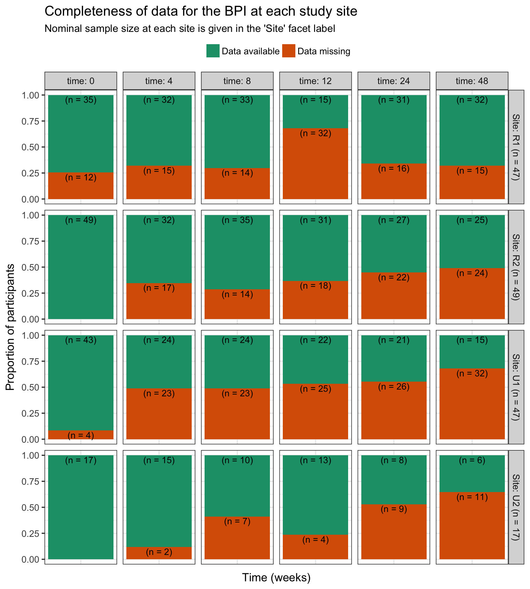
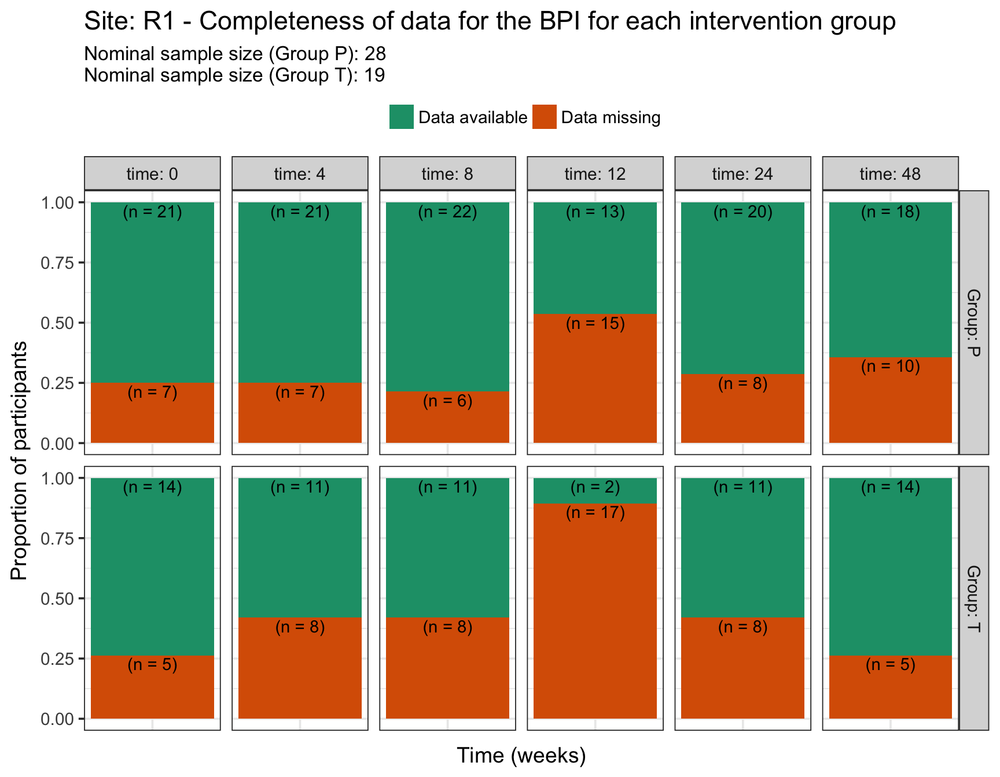
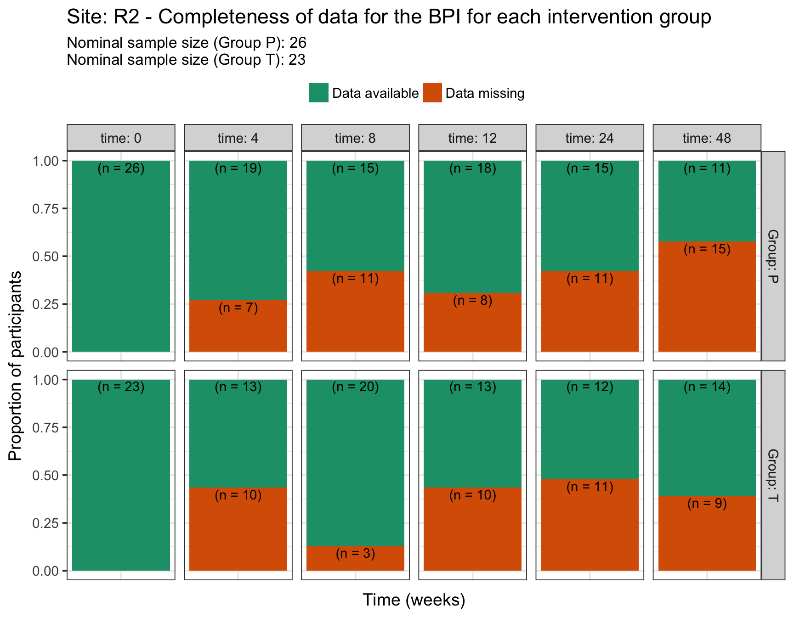
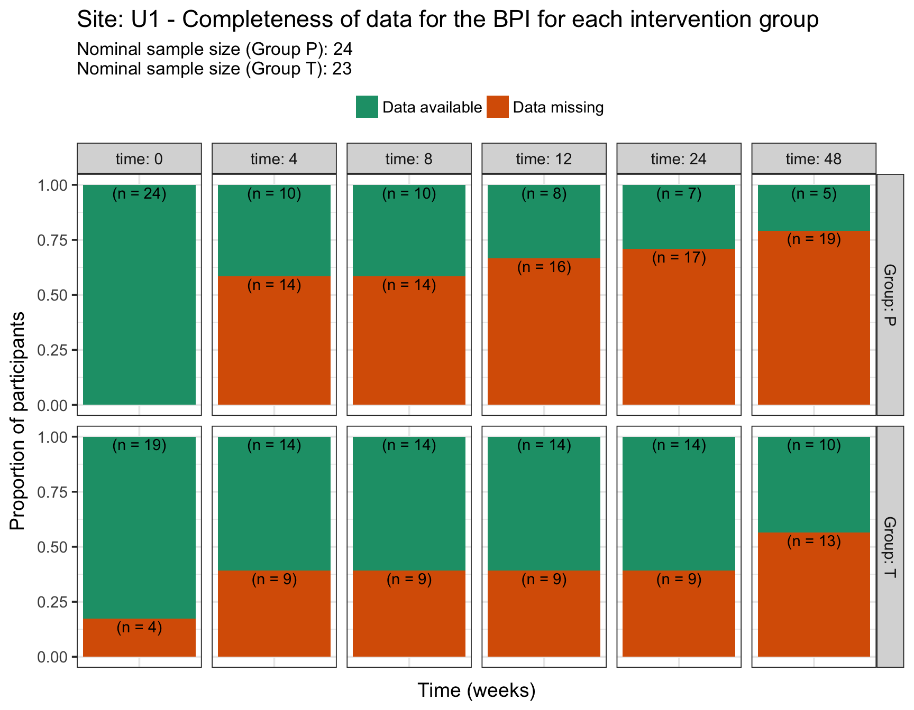
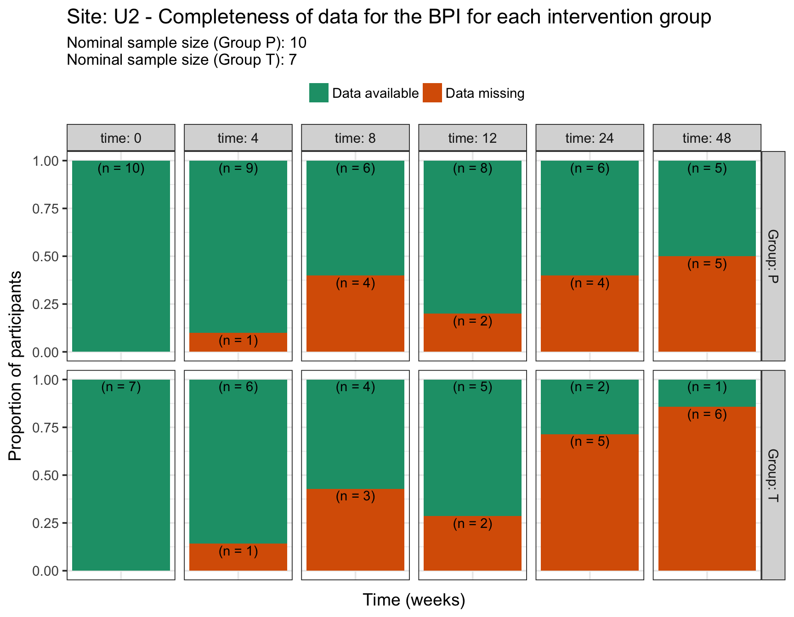
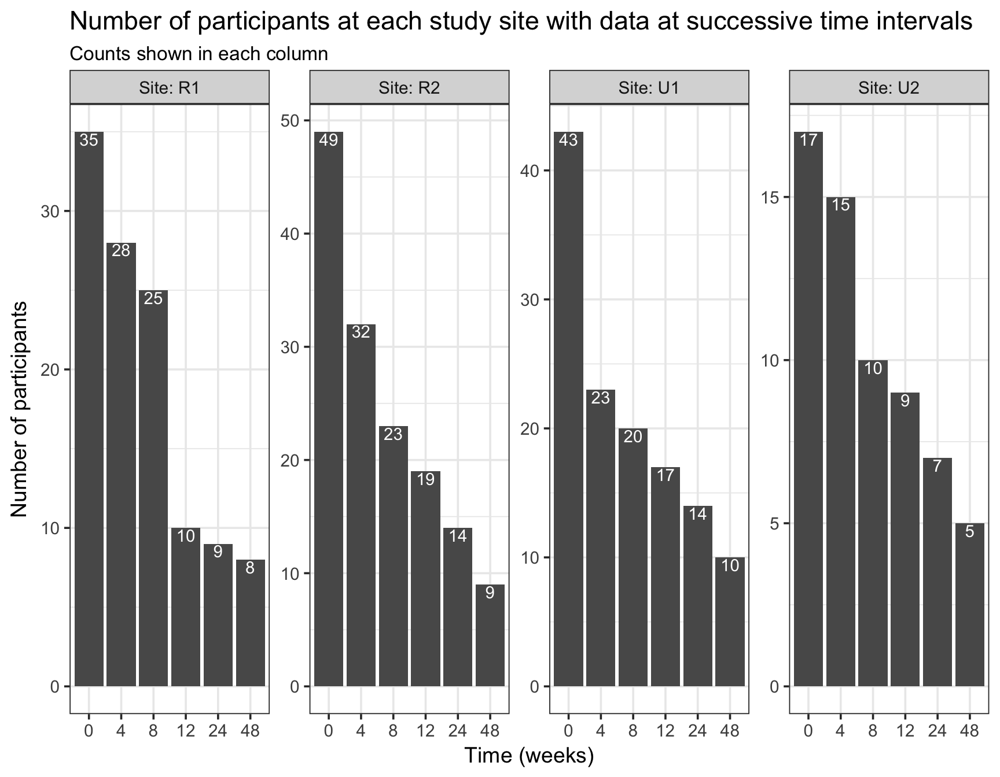
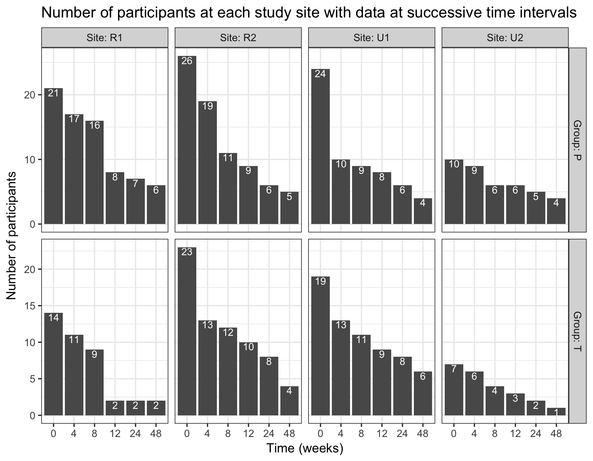

----

A descriptive analysis of the completeness of data across the 48 weeks of the trial.

Because the BPI is used to collect the primary outcome measure for the study (pain intensity), we assummed the BPI is representative of completion rates across all outcome measures (BDI, EQ-5D, Simmonds, and SE-6). 

----

# Import data


```r
# Read in bpi data
bpi <- read_rds('./data/bpi.rds') 

# Read in site and group info
foo <- read_rds('./data/demographics.rds') %>%
    select(ID, Site, Group, Sex)

# Join the two datasets 
bpi %<>%
    left_join(foo)
    
# Remove foo
rm(foo)
```

----

# Tabular summary of completeness

This summary ignores study site and intervention group stratification.


```r
bpi %>% 
    # Remove unneded columns
    select(-contains('_rx'), -ID, -Site, -Group, -Sex) %>% 
    # Skim to a df
    skim_to_wide() %>% 
    # Choose required columns 
    select(variable, missing, complete, n) %>%
    # Process df to make it more informative
    separate(col = variable,
             into = c('variable', 'time'),
             sep = '\\.') %>% 
    mutate(subscale = case_when(
        variable == 'Pain_present' ~ 'Pain_present',
        variable == 'Worst_pain' | 
            variable == 'Least_pain' |
            variable == 'Pain_now' |
            variable == 'Average_pain'  ~ 'Pain_intensity',
        variable == 'Mood' | 
            variable == 'Sleep' |
            variable == 'Activities_of_daily_living' |
            variable == 'Enjoyment_of_life' |
            variable == 'Relationship_with_others' |
            variable == 'Walking' |
            variable == 'Work' ~ 'Pain_interference'
    )) %>% 
    mutate(subscale = factor(subscale,
                             levels = c('Pain_present', 
                                        'Pain_intensity',
                                        'Pain_interference'),
                             ordered = TRUE),
           time = factor(time,
                         levels = c('BL', 'Wk4', 'Wk8', 
                                    'Wk12', 'Wk24', 'Wk48'),
                         ordered = TRUE)) %>% 
    select(variable, time, subscale, missing, complete, n) %>% 
    arrange(time, subscale) %>% 
    # Tabulate
    kable(caption = 'Tabular summary of data completeness')
```


Table: Tabular summary of data completeness

variable                     time   subscale            missing   complete   n   
---------------------------  -----  ------------------  --------  ---------  ----
Pain_present                 BL     Pain_present        16        144        160 
Average_pain                 BL     Pain_intensity      51        109        160 
Least_pain                   BL     Pain_intensity      16        144        160 
Pain_now                     BL     Pain_intensity      16        144        160 
Worst_pain                   BL     Pain_intensity      16        144        160 
Activities_of_daily_living   BL     Pain_interference   18        142        160 
Enjoyment_of_life            BL     Pain_interference   17        143        160 
Mood                         BL     Pain_interference   18        142        160 
Relationship_with_others     BL     Pain_interference   19        141        160 
Sleep                        BL     Pain_interference   17        143        160 
Walking                      BL     Pain_interference   17        143        160 
Work                         BL     Pain_interference   17        143        160 
Pain_present                 Wk4    Pain_present        57        103        160 
Average_pain                 Wk4    Pain_intensity      89        71         160 
Least_pain                   Wk4    Pain_intensity      58        102        160 
Pain_now                     Wk4    Pain_intensity      57        103        160 
Worst_pain                   Wk4    Pain_intensity      57        103        160 
Activities_of_daily_living   Wk4    Pain_interference   57        103        160 
Enjoyment_of_life            Wk4    Pain_interference   57        103        160 
Mood                         Wk4    Pain_interference   58        102        160 
Relationship_with_others     Wk4    Pain_interference   57        103        160 
Sleep                        Wk4    Pain_interference   57        103        160 
Walking                      Wk4    Pain_interference   57        103        160 
Work                         Wk4    Pain_interference   58        102        160 
Pain_present                 Wk8    Pain_present        58        102        160 
Average_pain                 Wk8    Pain_intensity      91        69         160 
Least_pain                   Wk8    Pain_intensity      58        102        160 
Pain_now                     Wk8    Pain_intensity      58        102        160 
Worst_pain                   Wk8    Pain_intensity      59        101        160 
Activities_of_daily_living   Wk8    Pain_interference   58        102        160 
Enjoyment_of_life            Wk8    Pain_interference   58        102        160 
Mood                         Wk8    Pain_interference   58        102        160 
Relationship_with_others     Wk8    Pain_interference   58        102        160 
Sleep                        Wk8    Pain_interference   58        102        160 
Walking                      Wk8    Pain_interference   58        102        160 
Work                         Wk8    Pain_interference   58        102        160 
Pain_present                 Wk12   Pain_present        79        81         160 
Average_pain                 Wk12   Pain_intensity      94        66         160 
Least_pain                   Wk12   Pain_intensity      79        81         160 
Pain_now                     Wk12   Pain_intensity      79        81         160 
Worst_pain                   Wk12   Pain_intensity      79        81         160 
Activities_of_daily_living   Wk12   Pain_interference   79        81         160 
Enjoyment_of_life            Wk12   Pain_interference   79        81         160 
Mood                         Wk12   Pain_interference   79        81         160 
Relationship_with_others     Wk12   Pain_interference   79        81         160 
Sleep                        Wk12   Pain_interference   79        81         160 
Walking                      Wk12   Pain_interference   79        81         160 
Work                         Wk12   Pain_interference   78        82         160 
Pain_present                 Wk24   Pain_present        73        87         160 
Average_pain                 Wk24   Pain_intensity      104       56         160 
Least_pain                   Wk24   Pain_intensity      73        87         160 
Pain_now                     Wk24   Pain_intensity      73        87         160 
Worst_pain                   Wk24   Pain_intensity      73        87         160 
Activities_of_daily_living   Wk24   Pain_interference   73        87         160 
Enjoyment_of_life            Wk24   Pain_interference   74        86         160 
Mood                         Wk24   Pain_interference   73        87         160 
Relationship_with_others     Wk24   Pain_interference   73        87         160 
Sleep                        Wk24   Pain_interference   73        87         160 
Walking                      Wk24   Pain_interference   75        85         160 
Work                         Wk24   Pain_interference   74        86         160 
Pain_present                 Wk48   Pain_present        82        78         160 
Average_pain                 Wk48   Pain_intensity      114       46         160 
Least_pain                   Wk48   Pain_intensity      82        78         160 
Pain_now                     Wk48   Pain_intensity      82        78         160 
Worst_pain                   Wk48   Pain_intensity      82        78         160 
Activities_of_daily_living   Wk48   Pain_interference   82        78         160 
Enjoyment_of_life            Wk48   Pain_interference   82        78         160 
Mood                         Wk48   Pain_interference   82        78         160 
Relationship_with_others     Wk48   Pain_interference   82        78         160 
Sleep                        Wk48   Pain_interference   82        78         160 
Walking                      Wk48   Pain_interference   82        78         160 
Work                         Wk48   Pain_interference   83        77         160 

Although there are small variations in the number of missing data across BPI items, the first item on the BDI assesses whether the participant has pain at the time of completing the questionniare (`Pain_present`), and it will be used as a proxy of missing data across all other items. 

Note that `Average_pain` values are greater because average pain data were not recorded at the _R1_ site (n = 47).

----

# Clean data


```r
# Gather into long format and process time/question column
bpi %<>%
    select(ID, Site, Group, starts_with('Pain_present')) %>% 
    gather(key = question,
           value = answer,
           -ID, - Site, - Group) %>%
    # Separate pain_question into constituent parts
    separate(col = question, 
             into = c('question', 'time'),
             sep = '\\.') %>%
    # Convert time points to integer
    ungroup() %>%
    mutate(time = str_replace(string = time, 
                              pattern = 'Wk',
                              replacement = ''),
           time = str_replace(string = time, 
                              pattern = 'BL',
                              replacement = '0'),
           time = as.integer(time)) 
```

----

# Graphical summaries of completeness

These summaries are stratified by study site, and study site and intervention group.

### Study site


```r
bpi %>%
    # Code whether data in bdi_rating is missing or not
    mutate(coding = ifelse(is.na(answer), 
                           yes = 'Data missing',
                           no = 'Data available')) %>% 
    # Get nominal sample size for each site
    group_by(Site, time) %>% 
    mutate(sample_size = n()) %>%
    ungroup() %>% 
    mutate(Site = paste0(Site, ' (n = ', sample_size, ')')) %>% 
    # Plot
    ggplot(data = .) +
    aes(x = question) +
    geom_bar(aes(fill = coding),
             position = position_fill()) +
    geom_text(position = position_fill(), 
              stat = 'count', 
              aes(group = coding,
                  label = paste0('(n = ', ..count.., ')')),
              vjust = 1.2) +
    labs(title = 'Completeness of data for the BPI at each study site',
         subtitle = "Nominal sample size at each site is given in the 'Site' facet label",
         x = 'Time (weeks)',
         y = 'Proportion of participants') +
    scale_fill_brewer(type = 'qual', 
                      palette = 'Dark2') +
    facet_grid(Site ~ time,
               labeller = label_both) +
    theme(legend.position = 'top',
          legend.title = element_blank(),
          axis.text.x = element_blank(),
          axis.ticks.x = element_blank())
```



### Study site and intervention group


```r
complete_group <- bpi %>%
    # Code whether data in bdi_rating is missing or not
    mutate(coding = ifelse(is.na(answer), 
                           yes = 'Data missing',
                           no = 'Data available')) %>% 
    # Nest
    group_by(Site) %>% 
    nest() %>% 
    arrange(Site) %>%
    # Calculate nominal number of participants per Site
    mutate(summary_p = map(.x = data,
                           ~ filter(.data = .x, 
                                    Group == 'P') %>%
                               summarise(count = as.integer(
                                   sum(!is.na(ID)) / 6))),
           summary_t = map(.x = data,
                           ~ filter(.data = .x, 
                                    Group == 'T') %>% 
                               summarise(count = as.integer(
                                   sum(!is.na(ID)) / 6)))) %>% 
    # Plot data
    mutate(plot = pmap(.l = list(data, Site, 
                                 summary_p, summary_t),
                       ~ ggplot(data = ..1) +
                           aes(x = question,
                               fill = coding) +
                           geom_bar(position = position_fill()) +
                           geom_text(position = position_fill(), 
                                     stat = 'count', 
                                     aes(label = paste0('(n = ', ..count.., ')')),
                                     vjust = 1.2) +
                           labs(title = str_glue('Site: {..2} - Completeness of data for the BPI for each intervention group'),
                                subtitle = str_glue('Nominal sample size (Group P): {..3}\nNominal sample size (Group T): {..4}'),
                                x = 'Time (weeks)',
                                y = 'Proportion of participants') +
                           scale_fill_brewer(type = 'qual', 
                                             palette = 'Dark2') +
                           facet_grid(Group ~ time, 
                                      labeller = label_both) +
                           theme(legend.position = 'top',
                                 legend.title = element_blank(),
                                 axis.text.x = element_blank(),
                                 axis.ticks.x = element_blank()))) 

# Print output
walk(.x = complete_group$plot, ~ print(.x))
```



----

# Continuous data collection

The number of participants with data across successive time points.

### Prepare data


```r
bpi_successive <- bpi %>% 
    # Recode the answer data to numeric (yes and no are legitimate answers)
    mutate(answer_numeric = case_when(
        answer == 'Yes' ~ '1',
        answer == 'No' ~ '1'
    ),
    answer_numeric = as.integer(answer_numeric)) %>% 
    # Generate the counts across time
    group_by(ID) %>% 
    mutate(cumulative_data = cumsum(answer_numeric)) 
```

### Study site


```r
bpi_successive %>%     
    group_by(Site, time, ID) %>% 
    summarise(count = sum(!is.na(cumulative_data))) %>% 
    ungroup() %>% 
    # Filter for counts > 0
    filter(count > 0) %>% 
    # Recount by Site and time
    group_by(Site, time) %>% 
    summarise(count = n()) %>% 
    ungroup() %>% 
    # Plot
    ggplot(data = .) +
    aes(x = factor(time), 
        y = count) +
    geom_bar(stat = 'identity') +
    geom_text(aes(label = count),
              vjust = 1.1,
              colour = '#FFFFFF') +
    labs(title = 'Number of participants at each study site with data at successive time intervals',
         subtitle = 'Counts shown in each column',
         x = 'Time (weeks)',
         y = 'Number of participants') +
    facet_wrap(~ Site,
               ncol = 4,
               labeller = label_both,
               scales = 'free_y')
```



### Study site and intervention group


```r
bpi_successive %>%     
    group_by(Site, Group, time, ID) %>% 
    summarise(count = sum(!is.na(cumulative_data))) %>% 
    ungroup() %>% 
    # Filter for counts > 0
    filter(count > 0) %>% 
    # Recount by Site and time
    group_by(Site, Group, time) %>% 
    summarise(count = n()) %>% 
    ungroup() %>% 
    # Plot
    ggplot(data = .) +
    aes(x = factor(time), 
        y = count) +
    geom_bar(stat = 'identity') +
    geom_text(aes(label = count),
              colour = '#FFFFFF',
              vjust = 1.1) +
    labs(title = 'Number of participants at each study site with data at successive time intervals',
         x = 'Time (weeks)',
         y = 'Number of participants') +
    facet_grid(Group ~ Site,
               labeller = label_both,
               scales = 'free_y')
```



----

# Summary

Other than site _R1_, the other sites have 100% or near 100% (_U1_) records at baseline (time = 0 weeks), thereafter, there is a trend for progressively more incomplete data over time. 

The number of participants with continuous data over successive reassessment time-points shows substantial drop-off over the 48 weeks.

----

# Session information


```
## R version 3.4.3 (2017-11-30)
## Platform: x86_64-apple-darwin15.6.0 (64-bit)
## Running under: macOS High Sierra 10.13.3
## 
## Matrix products: default
## BLAS: /Library/Frameworks/R.framework/Versions/3.4/Resources/lib/libRblas.0.dylib
## LAPACK: /Library/Frameworks/R.framework/Versions/3.4/Resources/lib/libRlapack.dylib
## 
## locale:
## [1] en_GB.UTF-8/en_GB.UTF-8/en_GB.UTF-8/C/en_GB.UTF-8/en_GB.UTF-8
## 
## attached base packages:
## [1] stats     graphics  grDevices utils     datasets  methods   base     
## 
## other attached packages:
##  [1] bindrcpp_0.2       skimr_1.0.1        magrittr_1.5      
##  [4] forcats_0.3.0      stringr_1.3.0      dplyr_0.7.4       
##  [7] purrr_0.2.4        readr_1.1.1        tidyr_0.8.0       
## [10] tibble_1.4.2       ggplot2_2.2.1.9000 tidyverse_1.2.1   
## 
## loaded via a namespace (and not attached):
##  [1] tidyselect_0.2.4   reshape2_1.4.3     pander_0.6.1      
##  [4] haven_1.1.1        lattice_0.20-35    colorspace_1.3-2  
##  [7] htmltools_0.3.6    yaml_2.1.17        rlang_0.2.0       
## [10] pillar_1.2.1       foreign_0.8-69     glue_1.2.0        
## [13] RColorBrewer_1.1-2 modelr_0.1.1       readxl_1.0.0      
## [16] bindr_0.1          plyr_1.8.4         munsell_0.4.3     
## [19] gtable_0.2.0       cellranger_1.1.0   rvest_0.3.2       
## [22] psych_1.7.8        evaluate_0.10.1    labeling_0.3      
## [25] knitr_1.20         parallel_3.4.3     highr_0.6         
## [28] broom_0.4.3        Rcpp_0.12.15       scales_0.5.0.9000 
## [31] backports_1.1.2    jsonlite_1.5       mnormt_1.5-5      
## [34] hms_0.4.1          digest_0.6.15      stringi_1.1.6     
## [37] grid_3.4.3         rprojroot_1.3-2    cli_1.0.0         
## [40] tools_3.4.3        lazyeval_0.2.1     crayon_1.3.4      
## [43] pkgconfig_2.0.1    xml2_1.2.0         lubridate_1.7.3   
## [46] assertthat_0.2.0   rmarkdown_1.9      httr_1.3.1        
## [49] rstudioapi_0.7     R6_2.2.2           nlme_3.1-131.1    
## [52] compiler_3.4.3
```
