----

Basic descriptive statistics of core demographic data at baseline (time = 0 weeks). No tests of statistical significance are performed (see baseline-analysis.* for NHST).

----

# Import data


```r
# Get data
demo <- read_rds('./data/demographics.rds')
```

----

# Quick look


```r
glimpse(demo)
```

```
## Observations: 160
## Variables: 21
## $ ID                   <chr> "J1", "J3", "J4", "J5", "J6", "J7", "J9",...
## $ Group                <chr> "P", "T", "P", "P", "P", "T", "T", "T", "...
## $ Site                 <chr> "U1", "U1", "U1", "U1", "U1", "U1", "U1",...
## $ Sex                  <chr> "female", "female", "female", "female", "...
## $ DOB                  <date> NA, NA, NA, NA, NA, NA, NA, NA, NA, NA, ...
## $ Age                  <dbl> 37, 36, 36, 58, 33, 32, 37, 46, 31, 36, 4...
## $ DODx                 <dbl> 2006, 2008, 2011, 1982, 2007, 2012, 2008,...
## $ Years_on_ART         <dbl> NA, NA, NA, NA, NA, NA, NA, NA, NA, NA, N...
## $ CD4                  <dbl> 354, 186, 172, 214, NA, 86, 103, 205, 420...
## $ CD4_recent           <dbl> NA, 728, NA, 189, NA, NA, 667, NA, 325, N...
## $ HIV_stage            <dbl> NA, NA, NA, NA, NA, NA, NA, NA, NA, NA, N...
## $ HIV_mx               <chr> "first-line", "first-line", "first-line",...
## $ `Years of schooling` <dbl> 12, NA, 11, 2, 12, 12, 9, 12, 12, 11, 9, ...
## $ SOS_mnemonic         <chr> NA, NA, NA, NA, NA, NA, NA, NA, NA, NA, N...
## $ Occupation           <chr> "employed", NA, "employed", "unemployed -...
## $ Adjuvant             <chr> "no", "no", "no", "no", "no", "no", "yes"...
## $ NSAID                <chr> "no", "no", "no", "no", "no", "no", "no",...
## $ Paracetamol          <chr> "yes", "no", "no", "no", "yes", "yes", "n...
## $ Mild_opioid          <chr> "no", "no", "no", "no", "no", "no", "no",...
## $ WHO_level            <dbl> 1, 0, 0, 0, 1, 1, 0, 0, 1, 0, 1, 0, 1, 0,...
## $ Years_education      <ord> 12, NA, 11, 2, 12, 12, 9, 12, 12, 11, 9, ...
```

```r
demo %>% 
    skim_to_wide() %>% 
    select(variable, missing, complete, n) %>%
    mutate_at(.vars = c(2:4),
              .funs = as.numeric) %>% 
    arrange(complete) %>% 
    kable(caption = 'Tabular summary of data completeness')
```


Table: Tabular summary of data completeness

variable              missing   complete     n
-------------------  --------  ---------  ----
HIV_stage                  96         64   160
Years_on_ART               78         82   160
CD4                        67         93   160
DODx                       52        108   160
SOS_mnemonic               47        113   160
DOB                        46        114   160
CD4_recent                 33        127   160
HIV_mx                      4        156   160
Years of schooling          4        156   160
Occupation                  3        157   160
Years_education             2        158   160
Adjuvant                    0        160   160
Group                       0        160   160
ID                          0        160   160
Mild_opioid                 0        160   160
NSAID                       0        160   160
Paracetamol                 0        160   160
Sex                         0        160   160
Site                        0        160   160
Age                         0        160   160
WHO_level                   0        160   160

----

# Sample size


```r
# Sample size by study site
demo %>%
    group_by(Site) %>%
    summarise(count = n()) %>%
    knitr::kable(., 
                 caption = 'Sample size by study site', 
                 col.names = c('Site', 'Count'))
```


Table: Sample size by study site

Site    Count
-----  ------
R1         47
R2         49
U1         47
U2         17

```r
# Sample size by study site and intervention group
demo %>%
    group_by(Site, Group) %>%
    summarise(count = n()) %>%
    group_by(Site) %>%
    mutate(percent = round(count / sum(count) * 100, 1)) %>%
    knitr::kable(., 
                 caption = 'Sample size by intervention group at each study site',
                 col.names = c('Site', 'Group', 'Count', 
                               'Percent (by site)'))
```


Table: Sample size by intervention group at each study site

Site   Group    Count   Percent (by site)
-----  ------  ------  ------------------
R1     P           28                59.6
R1     T           19                40.4
R2     P           26                53.1
R2     T           23                46.9
U1     P           24                51.1
U1     T           23                48.9
U2     P           10                58.8
U2     T            7                41.2

----

# Sex


```r
# Sex by study site
demo %>%
    group_by(Site, Sex) %>%
    summarise(count = sum(!is.na(Sex)),
              missing = sum(is.na(Sex))) %>%
    group_by(Site) %>%
    mutate(percent = round(count / sum(count) * 100, 1)) %>%
    knitr::kable(., 
                 caption = 'Self-identified sex by study site',
                 col.names = c('Site', 'Sex', 'Count', 'Missing', 
                               'Percent (by site)'))
```


Table: Self-identified sex by study site

Site   Sex       Count   Missing   Percent (by site)
-----  -------  ------  --------  ------------------
R1     male         47         0                 100
R2     female       49         0                 100
U1     female       31         0                  66
U1     male         16         0                  34
U2     female       17         0                 100

```r
# Plot 
ggplot(data = demo) +
    aes(x = Site,
        fill = Sex) +
    geom_bar(position = position_fill()) +
    labs(title = 'Participant sex (self-identified)',
         subtitle = 'Conditioned on study site',
         y = 'Proportion',
         x = 'Study site') +
    scale_fill_brewer(name = 'Sex: ',
                      type = 'qual',
                      palette = 'Dark2') +
    theme(legend.position = 'top')
```

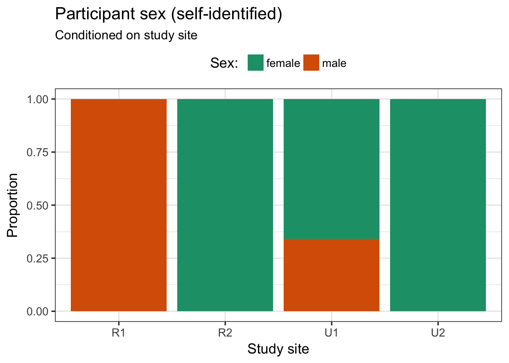

```r
# Sex by study site and intervention group
demo %>%
    group_by(Site, Group, Sex) %>%
    summarise(count = sum(!is.na(Sex)),
              missing = sum(is.na(Sex))) %>%
    group_by(Site) %>%
    mutate(sum = sum(count)) %>%
    mutate(percent = round(count / sum(count) * 100, 1)) %>%
    select(-sum) %>%
    knitr::kable(., 
                 caption = 'Self-identified sex by intervention group at each study site',
                 col.names = c('Site', 'Group', 'Sex', 'Count', 
                               'Missing', 'Percent (by site)'))
```


Table: Self-identified sex by intervention group at each study site

Site   Group   Sex       Count   Missing   Percent (by site)
-----  ------  -------  ------  --------  ------------------
R1     P       male         28         0                59.6
R1     T       male         19         0                40.4
R2     P       female       26         0                53.1
R2     T       female       23         0                46.9
U1     P       female       13         0                27.7
U1     P       male         11         0                23.4
U1     T       female       18         0                38.3
U1     T       male          5         0                10.6
U2     P       female       10         0                58.8
U2     T       female        7         0                41.2

```r
# Plot 
ggplot(data = demo) +
    aes(x = Group,
        fill = Sex) +
    geom_bar(position = position_fill()) +
    labs(title = 'Participant sex (self-identified)',
         subtitle = 'Conditioned on intervention group and study site',
         y = 'Proportion',
         x = 'Intervention group') +
    scale_fill_brewer(name = 'Sex: ',
                      type = 'qual',
                      palette = 'Dark2') +
    facet_wrap(~ Site, 
               ncol = 4, 
               labeller = label_both) +
    theme(legend.position = 'top')
```

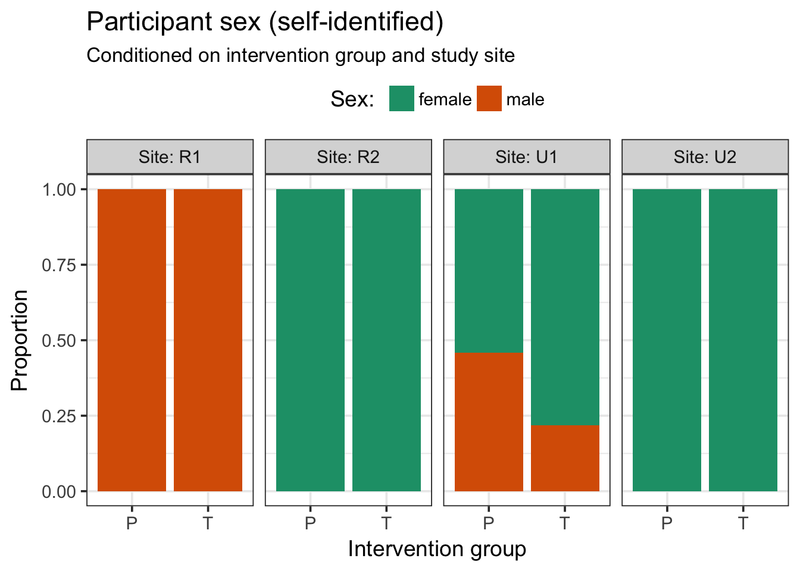

----

# Age


```r
# Age by study site
demo %>%
    group_by(Site) %>%
    summarise(count = sum(!is.na(Age)),
              missing = sum(is.na(Age)),
              mean = round(mean(Age), 1),
              sd = round(sd(Age), 1),
              range = paste0(round(min(Age), 2), ' - ', 
                             round(max(Age), 2))) %>%
    knitr::kable(., 
                 caption = 'Age (years) by study site',
                 col.names = c('Site', 'Count', 'Missing', 'Mean', 
                               'SD', 'Range'),
                 align = 'lrrrrr')
```


Table: Age (years) by study site

Site    Count   Missing   Mean    SD     Range
-----  ------  --------  -----  ----  --------
R1         47         0   35.3   3.0   28 - 40
R2         49         0   32.9   4.6   18 - 40
U1         47         0   39.3   6.3   27 - 58
U2         17         0   30.4   4.8   23 - 37

```r
# Plot 
ggplot(data = demo) +
    aes(y = Age,
        x = Site) +
    geom_boxplot(fill = '#666666',
                 colour = '#000000') +
    labs(title = 'Participant age',
         subtitle = 'Conditioned on study site',
         y = 'Age (years)',
         x = 'Study site') +
    theme(legend.position = 'none')
```

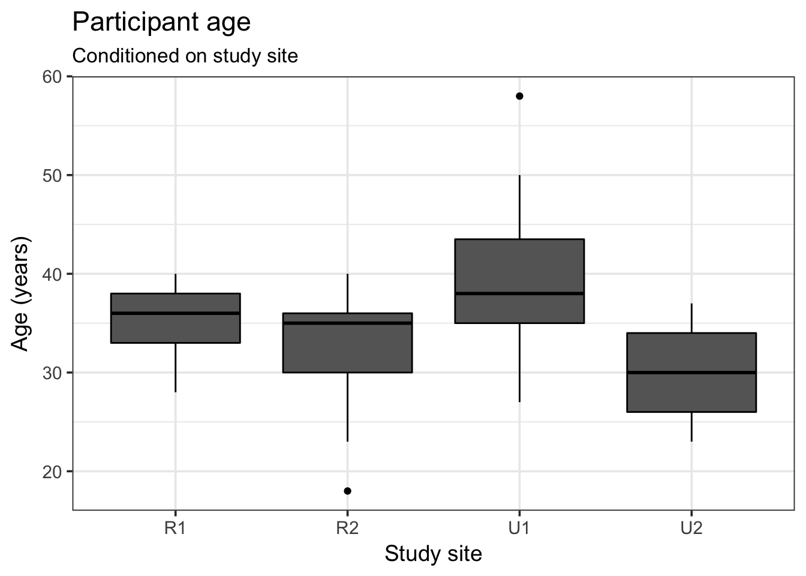

```r
# Age by study site and intervention group
demo %>%
    group_by(Site, Group) %>%
    summarise(count = sum(!is.na(Age)),
              missing = sum(is.na(Age)),
              mean = round(mean(Age), 1),
              sd = round(sd(Age), 1),
              range = paste0(round(min(Age), 2), ' - ', 
                             round(max(Age), 2))) %>%
    knitr::kable(., 
                 caption = 'Age (years) by intervention group at each study site',
                 col.names = c('Site', 'Group', 'Count', 'Missing', 
                               'Mean', 'SD', 'Range'),
                 align = 'llrrrrr')
```


Table: Age (years) by intervention group at each study site

Site   Group    Count   Missing   Mean    SD     Range
-----  ------  ------  --------  -----  ----  --------
R1     P           28         0   35.6   2.7   31 - 40
R1     T           19         0   34.7   3.4   28 - 40
R2     P           26         0   33.3   5.0   18 - 40
R2     T           23         0   32.4   4.2   23 - 40
U1     P           24         0   39.1   7.1   27 - 58
U1     T           23         0   39.6   5.4   30 - 49
U2     P           10         0   29.1   5.3   23 - 37
U2     T            7         0   32.3   3.5   26 - 36

```r
# Plot 
ggplot(data = demo) +
    aes(y = Age,
        x = Group,
        fill = Group) +
    geom_boxplot(position = position_dodge(0)) +
    labs(title = 'Participant age',
         subtitle = 'Conditioned on intervention group and study site',
         y = 'Age (years)',
         x = 'Intervention group') +
    scale_fill_brewer(name = 'Intervention group: ',
                      type = 'qual',
                      palette = 'Dark2') +
    facet_wrap(~ Site, 
               ncol = 4, 
               labeller = label_both) +
    theme(legend.position = 'top')
```

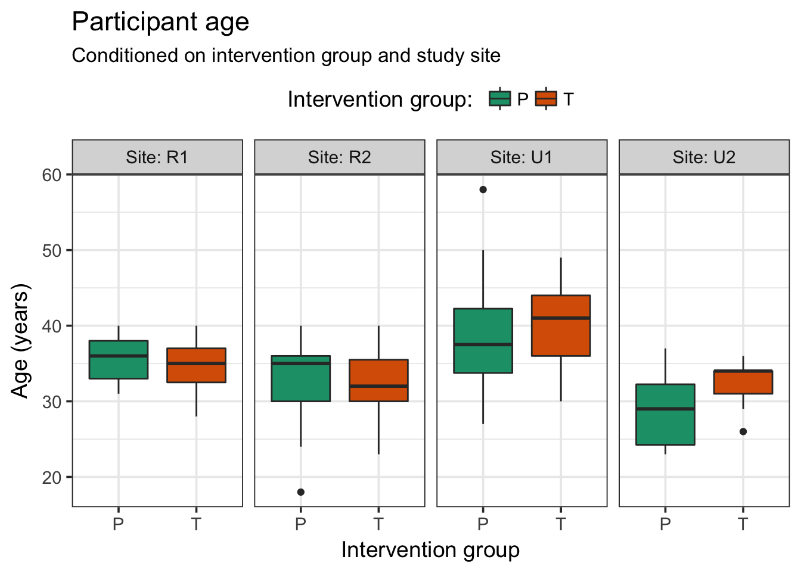

----

# CD4 T-cell count

### First recorded CD4


```r
# First CD4 by study site
demo %>%
    group_by(Site) %>%
    summarise(count = sum(!is.na(CD4)),
              missing = sum(is.na(CD4)),
              median = round(median(CD4, na.rm = TRUE)),
              IQR = paste0(round(quantile(CD4, prob = 0.25, na.rm = TRUE)), ' - ', 
                           round(quantile(CD4, prob = 0.75, na.rm = TRUE)))) %>%
    knitr::kable(., 
                 caption = 'First recorded CD4 (cells/ul) by study site',
                 col.names = c('Site', 'Count', 'Missing','Median', 'IQR'),
                 align = 'lrrrr')
```


Table: First recorded CD4 (cells/ul) by study site

Site    Count   Missing   Median         IQR
-----  ------  --------  -------  ----------
R1          0        47       NA     NA - NA
R2         39        10      220   180 - 284
U1         38         9      178   104 - 264
U2         16         1      420   194 - 524

```r
# Plot
ggplot(data = demo) +
    aes(y = CD4,
        x = Site) +
    geom_boxplot(fill = '#666666',
                 colour = '#000000') +
    labs(title = 'First recorded CD4 T-cell count',
         subtitle = 'Conditioned on study site',
         caption = '(Missing data: see table for details)',
         y = expression(CD4~count~(cells/mu*l)),
         x = 'Study site') +
    theme(legend.position = 'none')
```

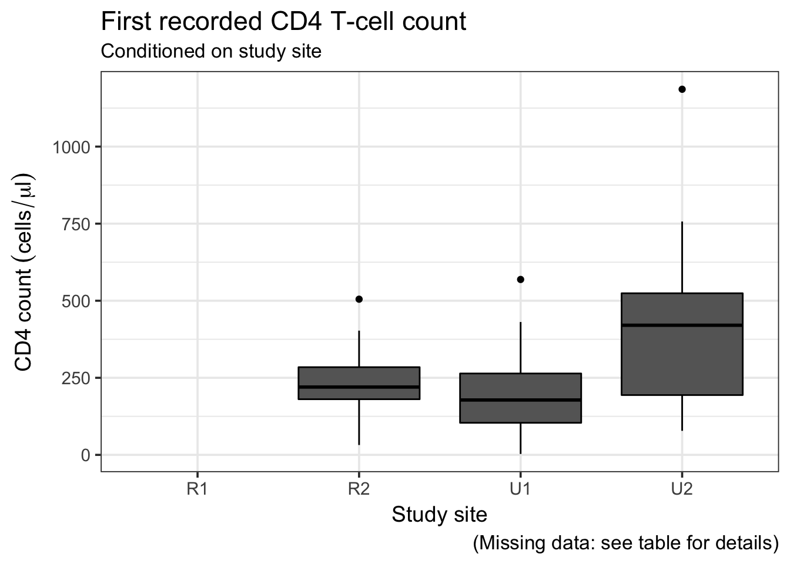

```r
# First CD4 by study site and intervention group
demo %>%
    group_by(Site, Group) %>%
    summarise(count = sum(!is.na(CD4)),
              missing = sum(is.na(CD4)),
              median = round(median(CD4, na.rm = TRUE)),
              IQR = paste0(round(quantile(CD4, prob = 0.25, na.rm = TRUE)), ' - ', 
                           round(quantile(CD4, prob = 0.75, na.rm = TRUE)))) %>%
    knitr::kable(., 
                 caption = 'First recorded CD4 (cells/ul) by intervention group at each study site',
                 col.names = c('Site', 'Group', 'Count', 'Missing', 
                               'Median', 'IQR'),
                 align = 'llrrrr')
```


Table: First recorded CD4 (cells/ul) by intervention group at each study site

Site   Group    Count   Missing   Median         IQR
-----  ------  ------  --------  -------  ----------
R1     P            0        28       NA     NA - NA
R1     T            0        19       NA     NA - NA
R2     P           23         3      207   170 - 266
R2     T           16         7      232   213 - 332
U1     P           18         6      152    60 - 206
U1     T           20         3      206   115 - 330
U2     P           10         0      434   168 - 607
U2     T            6         1      402   300 - 452

```r
# Plot
ggplot(data = demo) +
    aes(y = CD4,
        x = Group,
        fill = Group) +
    geom_boxplot(position = position_dodge(0)) +
    labs(title = 'First recorded CD4 T-cell count',
         subtitle = 'Conditioned on intervention group and study site',
         caption = '(Missing data: see table for details)',
         y = expression(CD4~count~(cells/mu*l)),
         x = 'Group') +
    scale_fill_brewer(name = 'Intervention group: ',
                      type = 'qual',
                      palette = 'Dark2') +
    facet_wrap(~ Site, 
               ncol = 4, 
               labeller = label_both) +
    theme(legend.position = 'top')
```

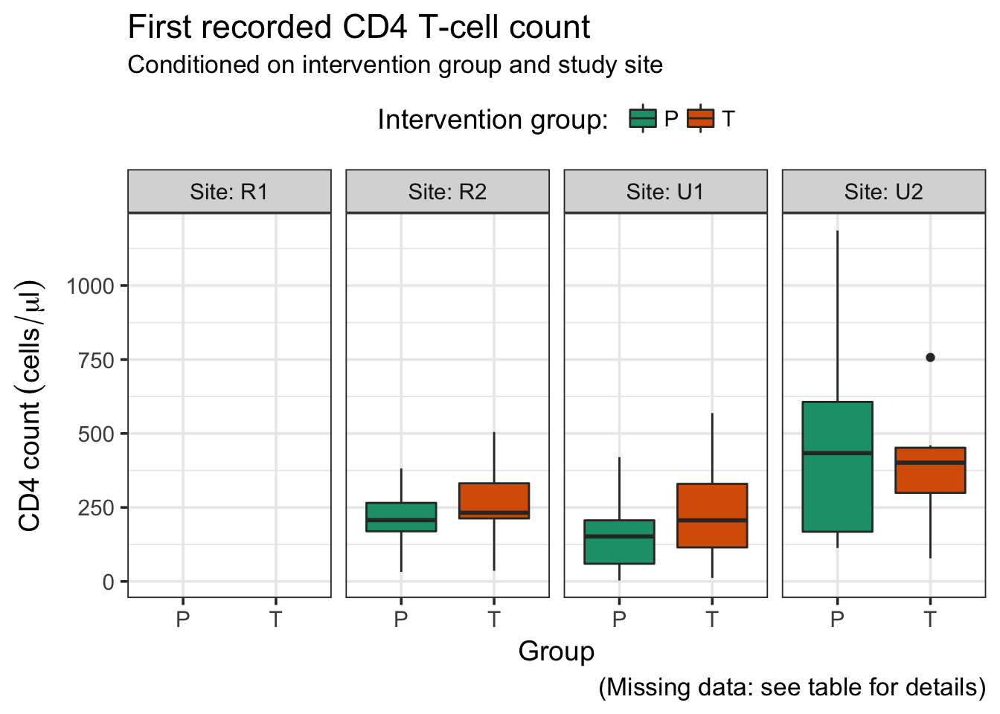

### Latest CD4 (baseline)


```r
# Latest CD4 by study site
demo %>%
    group_by(Site) %>%
    summarise(count = sum(!is.na(CD4_recent)),
              missing = sum(is.na(CD4_recent)),
              median = round(median(CD4_recent, na.rm = TRUE)),
              IQR = paste0(round(quantile(CD4_recent, prob = 0.25, na.rm = TRUE)), ' - ', 
                           round(quantile(CD4_recent, prob = 0.75, na.rm = TRUE)))) %>%
    knitr::kable(., 
                 caption = 'Latest recorded CD4 (cells/ul) by study site',
                 col.names = c('Site', 'Count','Missing', 'Median', 'IQR'),
                 align = 'lrrrr')
```


Table: Latest recorded CD4 (cells/ul) by study site

Site    Count   Missing   Median         IQR
-----  ------  --------  -------  ----------
R1         47         0      397   278 - 538
R2         46         3      414   273 - 566
U1         17        30      368   256 - 667
U2         17         0      471   414 - 648

```r
# Plot
ggplot(data = demo) +
    aes(y = CD4_recent,
        x = Site) +
    geom_boxplot(fill = '#666666',
                 colour = '#000000') +
    labs(title = 'Latest recorded CD4 T-cell count',
         subtitle = 'Conditioned on study site',
         caption = '(Missing data: see tables for details)',
         y = expression(CD4~count~(cells/mu*l)),
         x = 'Study site') +
    theme(legend.position = 'none')
```

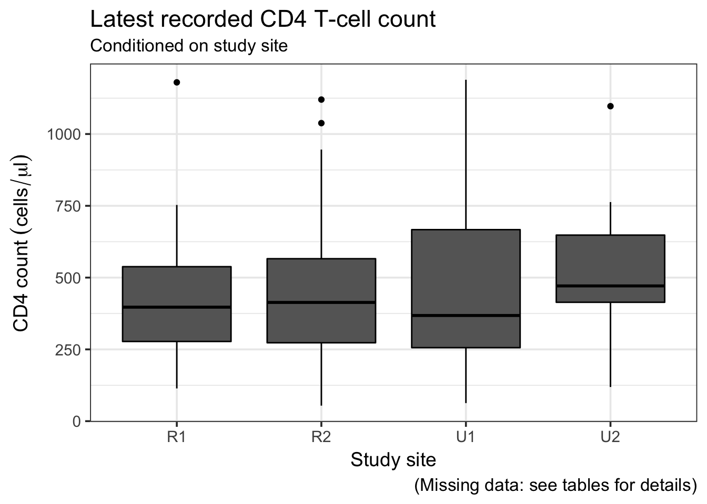

```r
# Latest CD4 by study site and intervention group
demo %>%
    group_by(Site, Group) %>%
    summarise(count = sum(!is.na(CD4_recent)),
              missing = sum(is.na(CD4_recent)),
              median = round(median(CD4_recent, na.rm = TRUE)),
              IQR = paste0(round(quantile(CD4_recent, prob = 0.25, na.rm = TRUE)), ' - ', 
                           round(quantile(CD4_recent, prob = 0.75, na.rm = TRUE)))) %>%
    knitr::kable(., 
                 caption = 'Latest recorded CD4 (cells/ul) by intervention group at each study site',
                 col.names = c('Site', 'Group', 'Count', 'Missing', 
                               'Median', 'IQR'),
                 align = 'llrrrr')
```


Table: Latest recorded CD4 (cells/ul) by intervention group at each study site

Site   Group    Count   Missing   Median         IQR
-----  ------  ------  --------  -------  ----------
R1     P           28         0      386   304 - 501
R1     T           19         0      424   262 - 593
R2     P           26         0      438   288 - 648
R2     T           20         3      406   265 - 516
U1     P            4        20      300   253 - 388
U1     T           13        10      445   256 - 728
U2     P           10         0      477   424 - 636
U2     T            7         0      457   402 - 630

```r
# Plot
ggplot(data = demo) +
    aes(y = CD4_recent,
        x = Group,
        fill = Group) +
    geom_boxplot(position = position_dodge(0)) +
    labs(title = 'Latest recorded CD4 T-cell count',
         subtitle = 'Conditioned on intervention group and study site',
         caption = '(Missing data: see tables for details)',
         y = expression(CD4~count~(cells/mu*l)),
         x = 'Group') +
    scale_fill_brewer(name = 'Intervention group: ',
                      type = 'qual',
                      palette = 'Dark2') +
    facet_wrap(~ Site, 
               ncol = 4, 
               labeller = label_both) +
    theme(legend.position = 'top') 
```

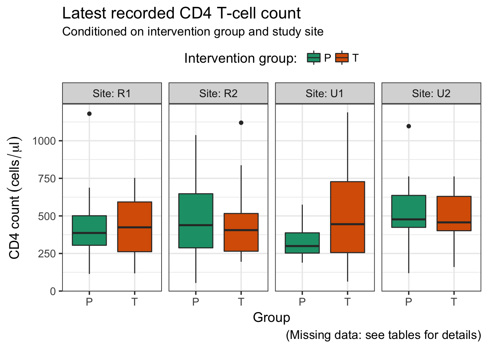

----

# Employment status


```r
# Occupation by study site
demo %>%
    group_by(Site, Occupation) %>%
    summarise(count = sum(!is.na(Occupation)),
              missing = sum(is.na(Occupation))) %>%
    group_by(Site) %>%
    mutate(percent = round((count / sum(count)) * 100, 1)) %>%
    mutate(count = case_when(
        count > missing ~ count,
        TRUE ~ missing
        ),
        percent = case_when(
            percent > 0 ~ as.character(percent),
            TRUE ~ '-'
            ),
        Occupation = case_when(
        is.na(Occupation) ~ 'missing data',
        TRUE ~ Occupation
        )) %>% 
    select(-missing) %>% 
    knitr::kable(., 
                 caption = 'Employment status by study site',
                 col.names = c('Site', 'Employment status', 'Count', 'Percent'),
                 align = 'llrr')
```


Table: Employment status by study site

Site   Employment status                    Count   Percent
-----  ----------------------------------  ------  --------
R1     employed                                21      46.7
R1     unable to work - disability grant        4       8.9
R1     unemployed - looking for work           16      35.6
R1     unemployed - not looking for work        4       8.9
R1     missing data                             2         -
R2     employed                                 8      16.3
R2     unable to work - disability grant        1         2
R2     unemployed - looking for work           17      34.7
R2     unemployed - not looking for work       23      46.9
U1     employed                                19      41.3
U1     student/volunteer                        1       2.2
U1     unable to work - disability grant        1       2.2
U1     unemployed - looking for work           23        50
U1     unemployed - not looking for work        2       4.3
U1     missing data                             1         -
U2     employed                                 3      17.6
U2     student/volunteer                        1       5.9
U2     unable to work - disability grant        2      11.8
U2     unemployed - looking for work            8      47.1
U2     unemployed - not looking for work        3      17.6

```r
# Plot 
demo %>%
    filter(!is.na(Occupation)) %>%
    ggplot(data = .) +
    aes(x = Site,
        colour = Occupation,
        fill = Occupation) +
    geom_bar(position = position_fill()) +
    labs(title = 'Employment status',
         subtitle = 'Conditioned on study site',
         caption = '(Missing data: see table for details)',
         y = 'Proportion',
         x = 'Study site') +
    scale_fill_brewer(name = 'Employment status: ',
                      type = 'qual',
                      palette = 'Dark2') +
    scale_colour_brewer(name = 'Employment status: ',
                        type = 'qual',
                        palette = 'Dark2') 
```

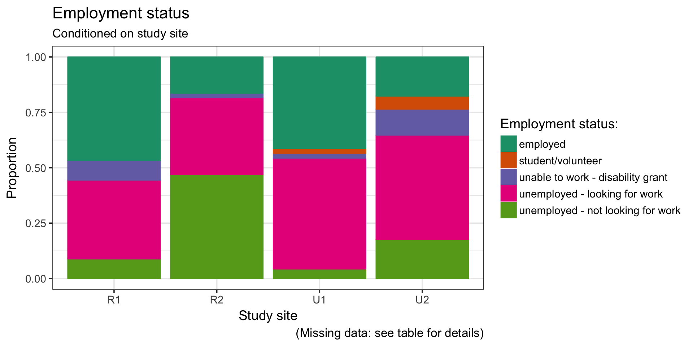

```r
# Occupation by study site and intervention group
demo %>%
    group_by(Site, Group, Occupation) %>%
    summarise(count = sum(!is.na(Occupation)),
              missing = sum(is.na(Occupation))) %>%
    group_by(Site) %>%
    mutate(percent = round((count / sum(count)) * 100, 1)) %>%
    mutate(count = case_when(
        count > missing ~ count,
        TRUE ~ missing
        ),
        percent = case_when(
            percent > 0 ~ as.character(percent),
            TRUE ~ '-'
            ),
        Occupation = case_when(
        is.na(Occupation) ~ 'missing data',
        TRUE ~ Occupation
        )) %>% 
    select(-missing) %>% 
    knitr::kable(., 
                 caption = 'Employment status by intervention group at each study site',
                 col.names = c('Site', 'Group', 'Employment status', 
                               'Count', 'Percent'),
                 align = 'lllrr')
```


Table: Employment status by intervention group at each study site

Site   Group   Employment status                    Count   Percent
-----  ------  ----------------------------------  ------  --------
R1     P       employed                                15      33.3
R1     P       unable to work - disability grant        3       6.7
R1     P       unemployed - looking for work            7      15.6
R1     P       unemployed - not looking for work        2       4.4
R1     P       missing data                             1         -
R1     T       employed                                 6      13.3
R1     T       unable to work - disability grant        1       2.2
R1     T       unemployed - looking for work            9        20
R1     T       unemployed - not looking for work        2       4.4
R1     T       missing data                             1         -
R2     P       employed                                 5      10.2
R2     P       unemployed - looking for work            9      18.4
R2     P       unemployed - not looking for work       12      24.5
R2     T       employed                                 3       6.1
R2     T       unable to work - disability grant        1         2
R2     T       unemployed - looking for work            8      16.3
R2     T       unemployed - not looking for work       11      22.4
U1     P       employed                                 8      17.4
U1     P       student/volunteer                        1       2.2
U1     P       unable to work - disability grant        1       2.2
U1     P       unemployed - looking for work           13      28.3
U1     P       unemployed - not looking for work        1       2.2
U1     T       employed                                11      23.9
U1     T       unemployed - looking for work           10      21.7
U1     T       unemployed - not looking for work        1       2.2
U1     T       missing data                             1         -
U2     P       employed                                 1       5.9
U2     P       student/volunteer                        1       5.9
U2     P       unable to work - disability grant        2      11.8
U2     P       unemployed - looking for work            6      35.3
U2     T       employed                                 2      11.8
U2     T       unemployed - looking for work            2      11.8
U2     T       unemployed - not looking for work        3      17.6

```r
# Plot
demo %>%
    filter(!is.na(Occupation)) %>%
    ggplot(data = .) +
    aes(x = Group,
        fill = Occupation) +
    geom_bar(position = position_fill()) +
    labs(title = 'Employment status',
         subtitle = 'Conditioned on intervention group and study site',
         caption = '(Missing data: see table for details)',
         y = 'Proportion',
         x = 'Group') +
    scale_fill_brewer(name = 'Employment status: ',
                      type = 'qual',
                      palette = 'Dark2') +
    facet_wrap(~ Site, 
               ncol = 4, 
               labeller = label_both)
```

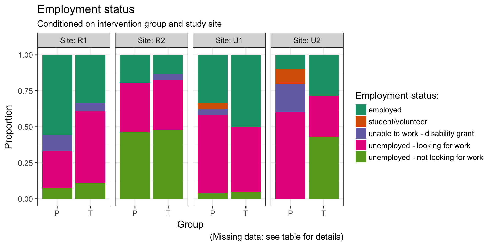

----

# Years of education


```r
# Education by study site
## R1
demo %>%
    filter(Site == 'R1') %>%
    group_by(Site, Years_education) %>%
    summarise(count = sum(!is.na(Years_education)),
              missing = sum(is.na(Years_education))) %>%
    group_by(Site) %>%
    mutate(percent = round((count / sum(count)) * 100, 1),
           percent = sprintf('%.1f', percent)) %>%
    mutate(Years_education = as.character(Years_education),
           Years_education = case_when(
        is.na(Years_education) ~ 'Missing data',
        TRUE ~ Years_education
        ),
        count = case_when(
            count > 0 ~ count,
            TRUE ~ missing
        ),
        percent = case_when(
            percent == '0.0' ~ '-',
            TRUE ~ percent
        )) %>% 
    ungroup() %>% 
    select(-Site, -missing) %>% 
    mutate(Years_education = factor(Years_education,
                                    levels = c(as.character(0:12), '12+'),
                                    ordered = TRUE)) %>% 
    knitr::kable(., 
                 caption = 'R1: Years of education by study site',
                 col.names = c('Years of education', 'Count', 'Percent'),
                 align = 'lrr')
```


Table: R1: Years of education by study site

Years of education    Count   Percent
-------------------  ------  --------
0                         1       2.1
2                         2       4.3
3                         2       4.3
4                         2       4.3
6                         3       6.4
7                         7      14.9
8                         3       6.4
9                         3       6.4
10                        5      10.6
11                        8      17.0
12                       11      23.4

```r
## R2
demo %>%
    filter(Site == 'R2') %>%
   group_by(Site, Years_education) %>%
    summarise(count = sum(!is.na(Years_education)),
              missing = sum(is.na(Years_education))) %>%
    group_by(Site) %>%
    mutate(percent = round((count / sum(count)) * 100, 1),
           percent = sprintf('%.1f', percent)) %>%
    mutate(Years_education = as.character(Years_education),
           Years_education = case_when(
        is.na(Years_education) ~ 'Missing data',
        TRUE ~ Years_education
        ),
        count = case_when(
            count > 0 ~ count,
            TRUE ~ missing
        ),
        percent = case_when(
            percent == '0.0' ~ '-',
            TRUE ~ percent
        )) %>% 
    ungroup() %>% 
    select(-Site, -missing) %>% 
    mutate(Years_education = factor(Years_education,
                                    levels = c(as.character(0:12), '12+'),
                                    ordered = TRUE)) %>% 
    knitr::kable(., 
                 caption = 'R2: Years of education by study site',
                 col.names = c('Years of education', 'Count', 'Percent'),
                 align = 'lrr')
```


Table: R2: Years of education by study site

Years of education    Count   Percent
-------------------  ------  --------
0                         4       8.2
3                         2       4.1
4                         3       6.1
5                         4       8.2
6                         4       8.2
7                         2       4.1
8                         4       8.2
9                        13      26.5
10                        2       4.1
11                        4       8.2
12                        7      14.3

```r
## U1
demo %>%
    filter(Site == 'U1') %>%
    group_by(Site, Years_education) %>%
    summarise(count = sum(!is.na(Years_education)),
              missing = sum(is.na(Years_education))) %>%
    group_by(Site) %>%
    mutate(percent = round((count / sum(count)) * 100, 1),
           percent = sprintf('%.1f', percent)) %>%
    mutate(Years_education = as.character(Years_education),
           Years_education = case_when(
        is.na(Years_education) ~ 'Missing data',
        TRUE ~ Years_education
        ),
        count = case_when(
            count > 0 ~ count,
            TRUE ~ missing
        ),
        percent = case_when(
            percent == '0.0' ~ '-',
            TRUE ~ percent
        )) %>% 
    ungroup() %>% 
    select(-Site, -missing) %>% 
    mutate(Years_education = factor(Years_education,
                                    levels = c(as.character(0:12), 
                                               '12+', 'Missing data'),
                                    ordered = TRUE)) %>% 
    knitr::kable(., 
                 caption = 'U1: Years of education by study site',
                 col.names = c('Years of education', 'Count', 'Percent'),
                 align = 'lrr')
```


Table: U1: Years of education by study site

Years of education    Count   Percent
-------------------  ------  --------
2                         1       2.2
6                         1       2.2
8                         5      11.1
9                         4       8.9
10                        6      13.3
11                        8      17.8
12                       18      40.0
12+                       2       4.4
Missing data              2         -

```r
## U2
demo %>%
    filter(Site == 'U2') %>%
    group_by(Site, Years_education) %>%
    summarise(count = sum(!is.na(Years_education)),
              missing = sum(is.na(Years_education))) %>%
    group_by(Site) %>%
    mutate(percent = round((count / sum(count)) * 100, 1),
           percent = sprintf('%.1f', percent)) %>%
    mutate(Years_education = as.character(Years_education),
           Years_education = case_when(
        is.na(Years_education) ~ 'Missing data',
        TRUE ~ Years_education
        ),
        count = case_when(
            count > 0 ~ count,
            TRUE ~ missing
        ),
        percent = case_when(
            percent == '0.0' ~ '-',
            TRUE ~ percent
        )) %>% 
    ungroup() %>% 
    select(-Site, -missing) %>% 
    mutate(Years_education = factor(Years_education,
                                    levels = c(as.character(0:12), 
                                               '12+', 'Missing data'),
                                    ordered = TRUE)) %>% 
    knitr::kable(., 
                 caption = 'U2: Years of education by study site',
                 col.names = c('Years of education', 'Count', 'Percent'),
                 align = 'lrr')
```


Table: U2: Years of education by study site

Years of education    Count   Percent
-------------------  ------  --------
0                         1       5.9
2                         2      11.8
7                         3      17.6
8                         2      11.8
9                         4      23.5
10                        4      23.5
12                        1       5.9

```r
# Plot
demo %>%
    filter(!is.na(Years_education)) %>%
    group_by(Site, Years_education) %>% 
    summarise(count = n()) %>%
    group_by(Site) %>% 
    mutate(proportion = count / sum(count)) %>% 
    ggplot(data = .) +
    aes(y = proportion,
        x = Years_education) +
    geom_bar(stat = 'identity') +
    labs(title = 'Years of education', 
         subtitle = 'Conditioned on study site',
         caption = '(Missing data: see tables for details)',
         x = 'Years of educations',
         y = 'Proportion') +
    facet_wrap(~ Site,
               ncol = 4,
               labeller = label_both)
```

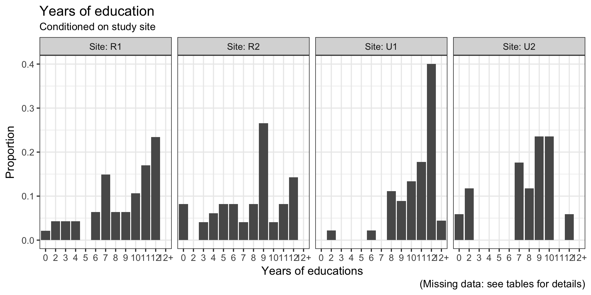


```r
# Education by intervention group at each study site
## R1
demo %>%
    filter(Site == 'R1') %>%
    group_by(Site, Group, Years_education) %>%
    summarise(count = sum(!is.na(Years_education)),
              missing = sum(is.na(Years_education))) %>%
    group_by(Site) %>%
    mutate(percent = round((count / sum(count)) * 100, 1),
           percent = sprintf('%.1f', percent)) %>%
    mutate(Years_education = as.character(Years_education),
           Years_education = case_when(
        is.na(Years_education) ~ 'Missing data',
        TRUE ~ Years_education
        ),
        count = case_when(
            count > 0 ~ count,
            TRUE ~ missing
        ),
        percent = case_when(
            percent == '0.0' ~ '-',
            TRUE ~ percent
        )) %>% 
    ungroup() %>% 
    select(-Site, -missing) %>% 
    mutate(Years_education = factor(Years_education,
                                    levels = c(as.character(0:12), 
                                               '12+', 'Missing data'),
                                    ordered = TRUE)) %>% 
    knitr::kable(., 
                 caption = 'R1: Years of education by study site',
                 col.names = c('Years of education', 'Group', 'Count', 'Percent'),
                 align = 'llrr')
```


Table: R1: Years of education by study site

Years of education   Group    Count   Percent
-------------------  ------  ------  --------
P                    0            1       2.1
P                    2            1       2.1
P                    3            1       2.1
P                    4            1       2.1
P                    6            3       6.4
P                    7            4       8.5
P                    8            2       4.3
P                    9            2       4.3
P                    10           2       4.3
P                    11           4       8.5
P                    12           7      14.9
T                    2            1       2.1
T                    3            1       2.1
T                    4            1       2.1
T                    7            3       6.4
T                    8            1       2.1
T                    9            1       2.1
T                    10           3       6.4
T                    11           4       8.5
T                    12           4       8.5

```r
## R2
demo %>%
    filter(Site == 'R2') %>%
    group_by(Site, Years_education) %>%
    summarise(count = sum(!is.na(Years_education)),
              missing = sum(is.na(Years_education))) %>%
    group_by(Site) %>%
    mutate(percent = round((count / sum(count)) * 100, 1),
           percent = sprintf('%.1f', percent)) %>%
    mutate(Years_education = as.character(Years_education),
           Years_education = case_when(
        is.na(Years_education) ~ 'Missing data',
        TRUE ~ Years_education
        ),
        count = case_when(
            count > 0 ~ count,
            TRUE ~ missing
        ),
        percent = case_when(
            percent == '0.0' ~ '-',
            TRUE ~ percent
        )) %>% 
    ungroup() %>% 
    select(-Site, -missing) %>% 
    mutate(Years_education = factor(Years_education,
                                    levels = c(as.character(0:12), 
                                               '12+', 'Missing data'),
                                    ordered = TRUE)) %>% 
    knitr::kable(., 
                 caption = 'R2: Years of education by study site',
                 col.names = c('Years of education', 'Count', 'Percent'),
                 align = 'lrr')
```


Table: R2: Years of education by study site

Years of education    Count   Percent
-------------------  ------  --------
0                         4       8.2
3                         2       4.1
4                         3       6.1
5                         4       8.2
6                         4       8.2
7                         2       4.1
8                         4       8.2
9                        13      26.5
10                        2       4.1
11                        4       8.2
12                        7      14.3

```r
## U1
demo %>%
    filter(Site == 'U1') %>%
    group_by(Site, Group, Years_education) %>%
    summarise(count = sum(!is.na(Years_education)),
              missing = sum(is.na(Years_education))) %>%
    group_by(Site) %>%
    mutate(percent = round((count / sum(count)) * 100, 1),
           percent = sprintf('%.1f', percent)) %>%
    mutate(Years_education = as.character(Years_education),
           Years_education = case_when(
        is.na(Years_education) ~ 'Missing data',
        TRUE ~ Years_education
        ),
        count = case_when(
            count > 0 ~ count,
            TRUE ~ missing
        ),
        percent = case_when(
            percent == '0.0' ~ '-',
            TRUE ~ percent
        )) %>% 
    ungroup() %>% 
    select(-Site, -missing) %>% 
    mutate(Years_education = factor(Years_education,
                                    levels = c(as.character(0:12), 
                                               '12+', 'Missing data'),
                                    ordered = TRUE)) %>% 
    knitr::kable(., 
                 caption = 'U1: Years of education by study site',
                 col.names = c('Years of education', 'Group', 'Count', 'Percent'),
                 align = 'llrr')
```


Table: U1: Years of education by study site

Years of education   Group           Count   Percent
-------------------  -------------  ------  --------
P                    2                   1       2.2
P                    6                   1       2.2
P                    8                   4       8.9
P                    9                   1       2.2
P                    10                  2       4.4
P                    11                  4       8.9
P                    12                 10      22.2
P                    12+                 1       2.2
T                    8                   1       2.2
T                    9                   3       6.7
T                    10                  4       8.9
T                    11                  4       8.9
T                    12                  8      17.8
T                    12+                 1       2.2
T                    Missing data        2         -

```r
## U2
demo %>%
    filter(Site == 'U2') %>%
    group_by(Site, Group, Years_education) %>%
    summarise(count = sum(!is.na(Years_education)),
              missing = sum(is.na(Years_education))) %>%
    group_by(Site) %>%
    mutate(percent = round((count / sum(count)) * 100, 1),
           percent = sprintf('%.1f', percent)) %>%
    mutate(Years_education = as.character(Years_education),
           Years_education = case_when(
        is.na(Years_education) ~ 'Missing data',
        TRUE ~ Years_education
        ),
        count = case_when(
            count > 0 ~ count,
            TRUE ~ missing
        ),
        percent = case_when(
            percent == '0.0' ~ '-',
            TRUE ~ percent
        )) %>% 
    ungroup() %>% 
    select(-Site, -missing) %>% 
    mutate(Years_education = factor(Years_education,
                                    levels = c(as.character(0:12), 
                                               '12+', 'Missing data'),
                                    ordered = TRUE)) %>% 
    knitr::kable(., 
                 caption = 'U2: Years of education by study site',
                 col.names = c('Years of education', 'Group', 'Count', 'Percent'),
                 align = 'llrr')
```


Table: U2: Years of education by study site

Years of education   Group    Count   Percent
-------------------  ------  ------  --------
P                    2            1       5.9
P                    8            2      11.8
P                    9            4      23.5
P                    10           2      11.8
P                    12           1       5.9
T                    0            1       5.9
T                    2            1       5.9
T                    7            3      17.6
T                    10           2      11.8

```r
# Plot
demo %>%
    filter(!is.na(Years_education)) %>%
    group_by(Site, Group, Years_education) %>% 
    summarise(count = n()) %>%
    group_by(Site, Group) %>% 
    mutate(proportion = count / sum(count)) %>% 
    ggplot(data = .) +
    aes(y = proportion,
        x = Years_education,
        fill = Group) +
    geom_bar(stat = 'identity') +
    labs(title = 'Years of education', 
         subtitle = 'Conditioned on intervention group and study site',
         caption = '(Missing data: see tables for details)',
         x = 'Years of educations',
         y = 'Proportion') +
    scale_fill_brewer(type = 'qual',
                      palette = 'Dark2') +
    facet_grid(Group ~ Site,
               labeller = label_both) +
    theme(legend.position = 'none')
```

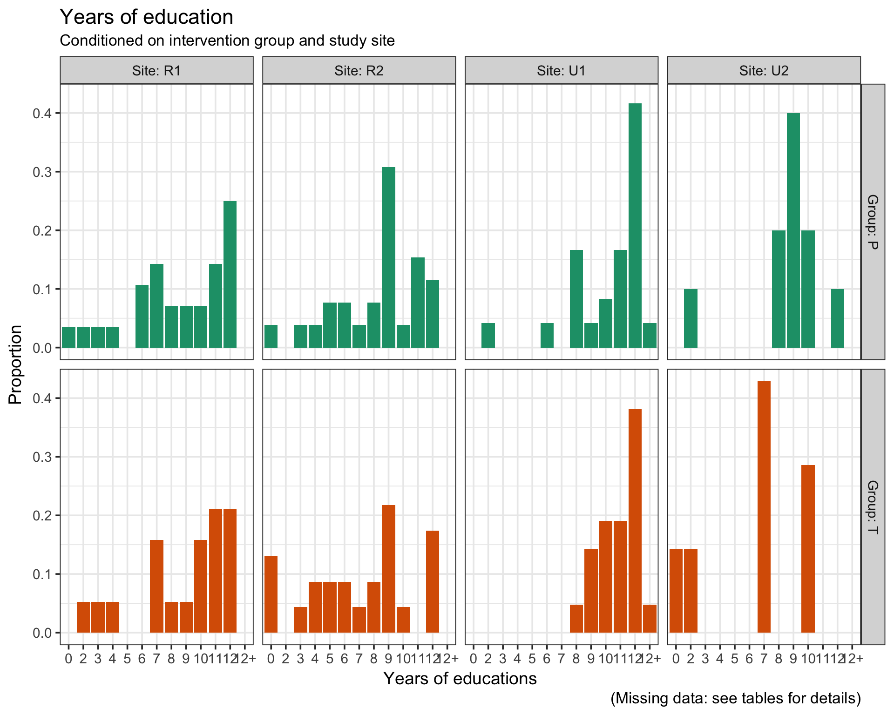

----

# SOS health literacy


```r
# Health literacy by study site
demo %>%
    group_by(Site, SOS_mnemonic) %>%
    summarise(count = sum(!is.na(SOS_mnemonic)),
              missing = sum(is.na(SOS_mnemonic))) %>%
    group_by(Site) %>%
    mutate(percent = round((count / sum(count)) * 100, 1),
           percent = sprintf('%.1f', percent)) %>%
    mutate(SOS_mnemonic = case_when(
        is.na(SOS_mnemonic) ~ 'Missing data',
        TRUE ~ SOS_mnemonic
        ),
        count = case_when(
            count > 0 ~ count,
            TRUE ~ missing
        ),
        percent = case_when(
            percent == 'NaN' ~ '-',
            TRUE ~ percent
        )) %>% 
    mutate(SOS_mnemonic = factor(SOS_mnemonic,
                                 levels = c('hl', 'lhl', 'Missing data')),
           SOS_mnemonic = fct_recode(SOS_mnemonic,
                                     'Health literate' = 'hl',
                                     'Low health literacy' = 'lhl')) %>%
    select(-missing) %>% 
    knitr::kable(., 
                 caption = 'SOS health literacy by study site',
                 col.names = c('Site', 'Literacy state', 'Count', 'Percent'),
                 align = 'llrr')
```


Table: SOS health literacy by study site

Site   Literacy state         Count   Percent
-----  --------------------  ------  --------
R1     Health literate           28      59.6
R1     Low health literacy       19      40.4
R2     Low health literacy       49     100.0
U1     Missing data              47         -
U2     Health literate            7      41.2
U2     Low health literacy       10      58.8

```r
# Plot 
demo %>%
    filter(!is.na(SOS_mnemonic)) %>%
    ggplot(data = .) +
    aes(x = Site,
        colour = SOS_mnemonic,
        fill = SOS_mnemonic) +
    geom_bar(position = position_fill()) +
    labs(title = 'Health literacy',
         subtitle = 'Conditioned on study site',
         caption = 'Missing data: see tables for details',
         y = 'Proportion',
         x = 'Study site') +
    scale_fill_brewer(name = 'Literacy status: ',
                      labels = c('Health literate', 'Low health literacy'),
                      type = 'qual',
                      palette = 'Dark2') +
    scale_colour_brewer(name = 'Literacy status: ',
                        labels = c('Health literate', 'Low health literacy'),
                        type = 'qual',
                        palette = 'Dark2') +
    theme(legend.position = 'top')
```

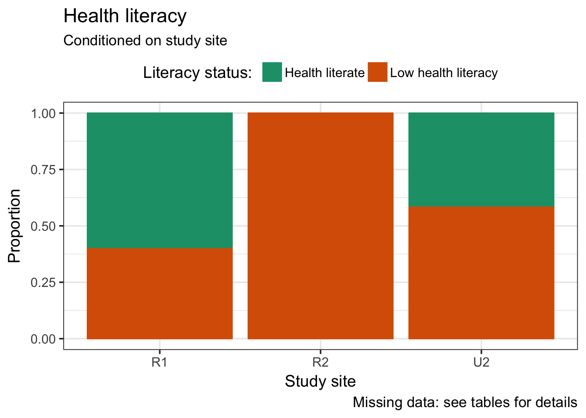

```r
# Health literacy by study site and intervention group
demo %>%
    group_by(Site, Group, SOS_mnemonic) %>%
    summarise(count = sum(!is.na(SOS_mnemonic)),
              missing = sum(is.na(SOS_mnemonic))) %>%
    group_by(Site) %>%
    mutate(percent = round((count / sum(count)) * 100, 1),
           percent = sprintf('%.1f', percent)) %>%
    mutate(SOS_mnemonic = case_when(
        is.na(SOS_mnemonic) ~ 'Missing data',
        TRUE ~ SOS_mnemonic
        ),
        count = case_when(
            count > 0 ~ count,
            TRUE ~ missing
        ),
        percent = case_when(
            percent == 'NaN' ~ '-',
            TRUE ~ percent
        )) %>% 
    mutate(SOS_mnemonic = factor(SOS_mnemonic,
                                 levels = c('hl', 'lhl', 'Missing data')),
           SOS_mnemonic = fct_recode(SOS_mnemonic,
                                     'Health literate' = 'hl',
                                     'Low health literacy' = 'lhl')) %>%
    select(-missing) %>% 
    knitr::kable(., 
                 caption = 'SOS health literacy by intervention group at each study site',
                 col.names = c('Site', 'Group', 'Literacy state', 
                               'Count', 'Percent'),
                 align = 'lllrr')
```


Table: SOS health literacy by intervention group at each study site

Site   Group   Literacy state         Count   Percent
-----  ------  --------------------  ------  --------
R1     P       Health literate           16      34.0
R1     P       Low health literacy       12      25.5
R1     T       Health literate           12      25.5
R1     T       Low health literacy        7      14.9
R2     P       Low health literacy       26      53.1
R2     T       Low health literacy       23      46.9
U1     P       Missing data              24         -
U1     T       Missing data              23         -
U2     P       Health literate            5      29.4
U2     P       Low health literacy        5      29.4
U2     T       Health literate            2      11.8
U2     T       Low health literacy        5      29.4

```r
# Plot 
demo %>%
    filter(!is.na(SOS_mnemonic)) %>%
    ggplot(data = .) +
    aes(x = Group,
        colour = SOS_mnemonic,
        fill = SOS_mnemonic) +
    geom_bar(position = position_fill()) +
    labs(title = 'Health literacy',
         subtitle = 'Conditioned on intervention group and study site',
         caption = '(Missing data: see table for details)',
         y = 'Proportion',
         x = 'Group') +
    scale_fill_brewer(name = 'Literacy status: ',
                      labels = c('Health literate', 'Low health literacy'),
                      type = 'qual',
                      palette = 'Dark2') +
    scale_colour_brewer(name = 'Literacy status: ',
                        labels = c('Health literate', 'Low health literacy'),
                        type = 'qual',
                        palette = 'Dark2') +
    theme(legend.position = 'top') +
    facet_wrap(~ Site, 
               ncol = 4, 
               labeller = label_both)
```

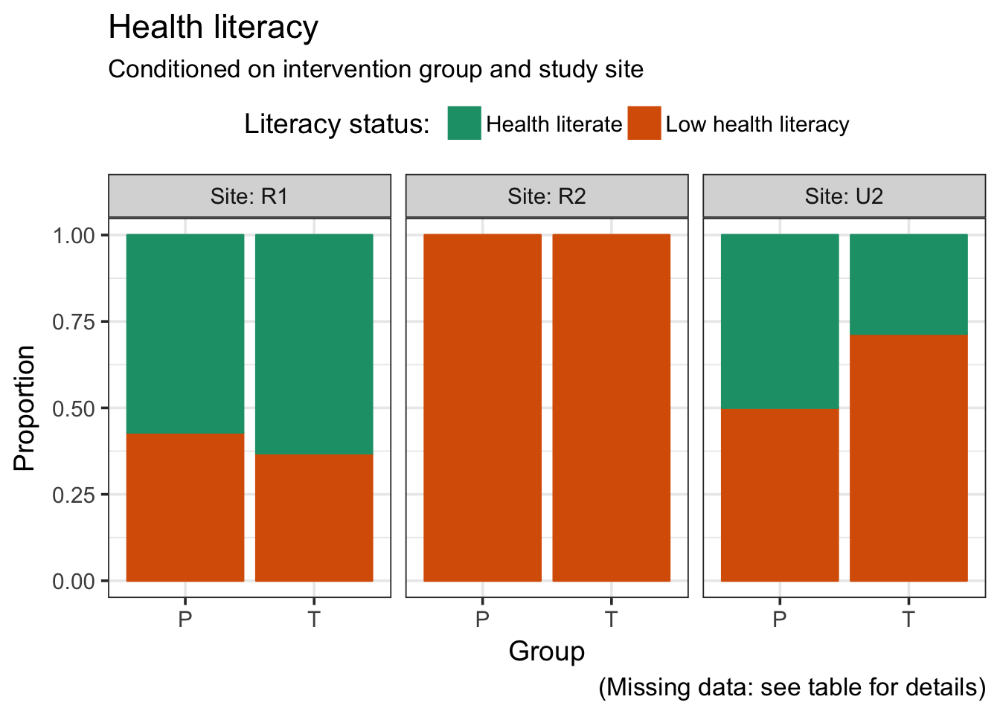

----

# Session information


```
## R version 3.4.3 (2017-11-30)
## Platform: x86_64-apple-darwin15.6.0 (64-bit)
## Running under: macOS High Sierra 10.13.3
## 
## Matrix products: default
## BLAS: /Library/Frameworks/R.framework/Versions/3.4/Resources/lib/libRblas.0.dylib
## LAPACK: /Library/Frameworks/R.framework/Versions/3.4/Resources/lib/libRlapack.dylib
## 
## locale:
## [1] en_GB.UTF-8/en_GB.UTF-8/en_GB.UTF-8/C/en_GB.UTF-8/en_GB.UTF-8
## 
## attached base packages:
## [1] stats     graphics  grDevices utils     datasets  methods   base     
## 
## other attached packages:
##  [1] bindrcpp_0.2       skimr_1.0.1        forcats_0.3.0     
##  [4] stringr_1.3.0      dplyr_0.7.4        purrr_0.2.4       
##  [7] readr_1.1.1        tidyr_0.8.0        tibble_1.4.2      
## [10] ggplot2_2.2.1.9000 tidyverse_1.2.1   
## 
## loaded via a namespace (and not attached):
##  [1] tidyselect_0.2.4   reshape2_1.4.3     pander_0.6.1      
##  [4] haven_1.1.1        lattice_0.20-35    colorspace_1.3-2  
##  [7] htmltools_0.3.6    yaml_2.1.18        rlang_0.2.0       
## [10] pillar_1.2.1       foreign_0.8-69     glue_1.2.0        
## [13] RColorBrewer_1.1-2 modelr_0.1.1       readxl_1.0.0      
## [16] bindr_0.1          plyr_1.8.4         munsell_0.4.3     
## [19] gtable_0.2.0       cellranger_1.1.0   rvest_0.3.2       
## [22] psych_1.7.8        evaluate_0.10.1    labeling_0.3      
## [25] knitr_1.20         parallel_3.4.3     highr_0.6         
## [28] broom_0.4.3        Rcpp_0.12.16       scales_0.5.0.9000 
## [31] backports_1.1.2    jsonlite_1.5       mnormt_1.5-5      
## [34] hms_0.4.1          digest_0.6.15      stringi_1.1.6     
## [37] grid_3.4.3         rprojroot_1.3-2    cli_1.0.0         
## [40] tools_3.4.3        magrittr_1.5       lazyeval_0.2.1    
## [43] crayon_1.3.4       pkgconfig_2.0.1    xml2_1.2.0        
## [46] lubridate_1.7.3    assertthat_0.2.0   rmarkdown_1.9     
## [49] httr_1.3.1         rstudioapi_0.7     R6_2.2.2          
## [52] nlme_3.1-131.1     compiler_3.4.3
```
