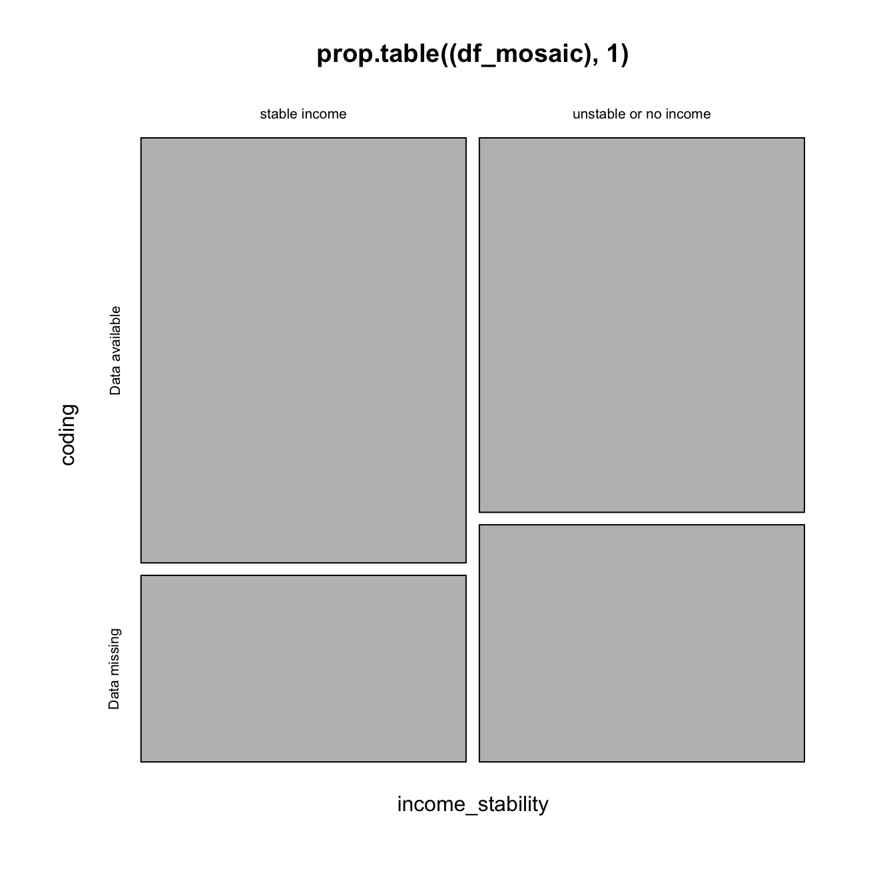
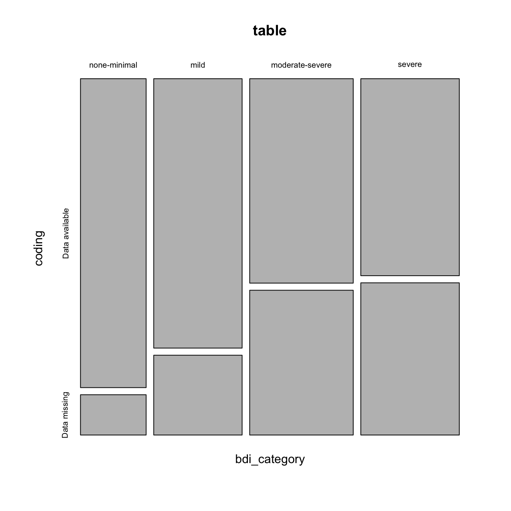
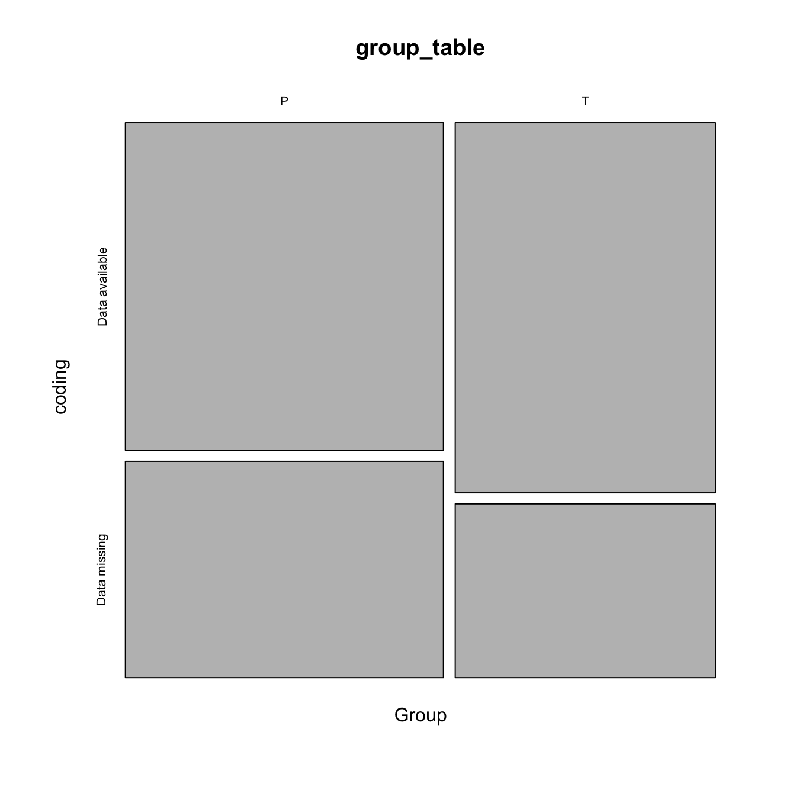
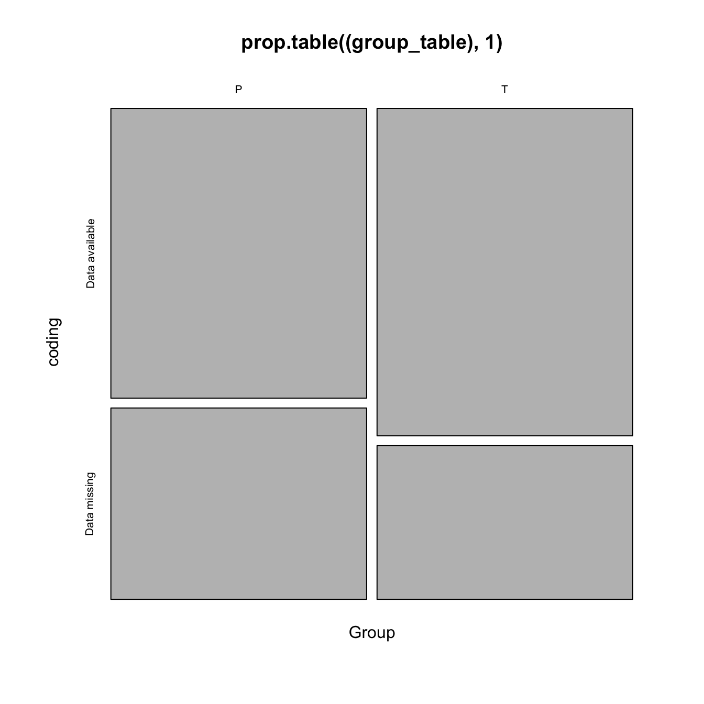
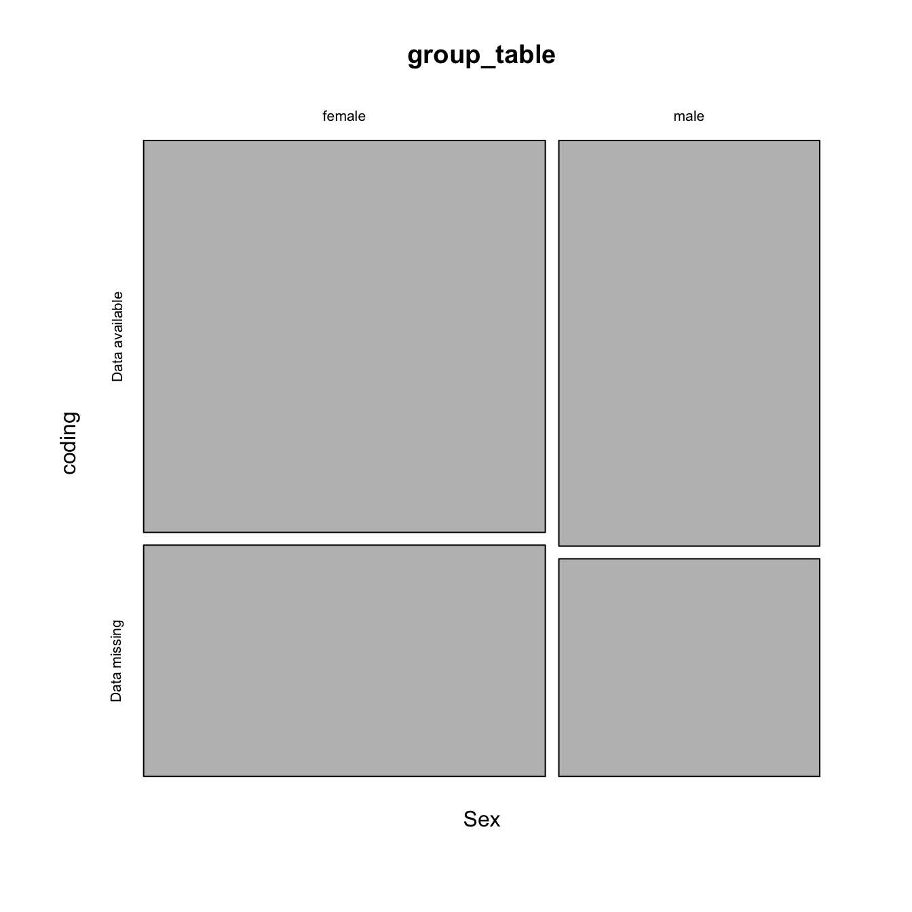
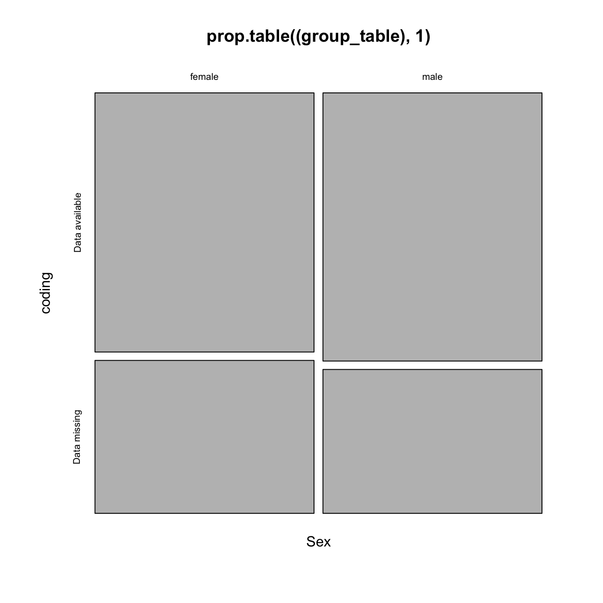

----

# Import data


```r
# Get data
demo <- read_rds('./data/demographics.rds')
```

----

# Quick look


```r
glimpse(demo)
```

```
## Observations: 160
## Variables: 21
## $ ID                   <chr> "J1", "J3", "J4", "J5", "J6", "J7", "J9",...
## $ Group                <chr> "P", "T", "P", "P", "P", "T", "T", "T", "...
## $ Site                 <chr> "U1", "U1", "U1", "U1", "U1", "U1", "U1",...
## $ Sex                  <chr> "female", "female", "female", "female", "...
## $ DOB                  <date> NA, NA, NA, NA, NA, NA, NA, NA, NA, NA, ...
## $ Age                  <dbl> 37, 36, 36, 58, 33, 32, 37, 46, 31, 36, 4...
## $ DODx                 <dbl> 2006, 2008, 2011, 1982, 2007, 2012, 2008,...
## $ Years_on_ART         <dbl> NA, NA, NA, NA, NA, NA, NA, NA, NA, NA, N...
## $ CD4                  <dbl> 354, 186, 172, 214, NA, 86, 103, 205, 420...
## $ CD4_recent           <dbl> NA, 728, NA, 189, NA, NA, 667, NA, 325, N...
## $ HIV_stage            <dbl> NA, NA, NA, NA, NA, NA, NA, NA, NA, NA, N...
## $ HIV_mx               <chr> "first-line", "first-line", "first-line",...
## $ `Years of schooling` <dbl> 12, NA, 11, 2, 12, 12, 9, 12, 12, 11, 9, ...
## $ SOS_mnemonic         <chr> NA, NA, NA, NA, NA, NA, NA, NA, NA, NA, N...
## $ Occupation           <chr> "employed", NA, "employed", "unemployed -...
## $ Adjuvant             <chr> "no", "no", "no", "no", "no", "no", "yes"...
## $ NSAID                <chr> "no", "no", "no", "no", "no", "no", "no",...
## $ Paracetamol          <chr> "yes", "no", "no", "no", "yes", "yes", "n...
## $ Mild_opioid          <chr> "no", "no", "no", "no", "no", "no", "no",...
## $ WHO_level            <dbl> 1, 0, 0, 0, 1, 1, 0, 0, 1, 0, 1, 0, 1, 0,...
## $ Years_education      <ord> 12, NA, 11, 2, 12, 12, 9, 12, 12, 11, 9, ...
```

----

# Recode employment


```r
# Mutate new column to reclassify employment status into income grouping

demo %<>%
    mutate(income_stability = case_when(
        Occupation == "employed" | Occupation == "unable to work - disability grant" ~ "stable income",
        Occupation == "student/volunteer" | Occupation == "unemployed - looking for work" | Occupation == "unemployed - not looking for work" ~ "unstable or no income",
        Occupation == "NA" ~ "NA"))

count <- demo %>% group_by(income_stability) %>%
    summarise(count = n())
print(count)
```

```
## # A tibble: 3 x 2
##   income_stability      count
##   <chr>                 <int>
## 1 stable income            59
## 2 unstable or no income    98
## 3 <NA>                      3
```

----

# Tidy up and save as rds


```r
income_stability <- demo %>% select(ID,
                 income_stability,
                 Sex,
                 Site,
                 Group)

# Save outputs
write_rds(x = income_stability, 
          path = './data/income_data.rds')
write_csv(x = income_stability,
          path = './data/income_data.csv')
```

# Import BPI data


```r
# Read in bpi data
bpi <- read_rds('./data/bpi.rds') 

# Read in site and group info
foo <- read_rds('./data/demographics.rds') %>%
    select(ID, Site, Group, Sex)

# Join the two datasets 
bpi %<>%
    left_join(foo)
    
# Remove foo
rm(foo)
```

----

Although there are small variations in the number of missing data across BPI items, the first item on the BDI assesses whether the participant has pain at the time of completing the questionniare (`Pain_present`), and it will be used as a proxy of missing data across all other items. 

Note that `Average_pain` values are greater because average pain data were not recorded at the _R1_ site (n = 47).

----

# Clean BPI data


```r
# Select for Week 8  
    bpi %<>% select(ID,
                    Pain_present.Wk8)

bpi %<>%
    # Code whether data in bdi_rating is missing or not
    mutate(coding = ifelse(is.na(Pain_present.Wk8), 
                           yes = 'Data missing',
                           no = 'Data available'))
```

# Bind data frames together


```r
df <- income_stability %>% right_join(bpi)

df_mosaic <- xtabs(~ income_stability + coding, data = df)

foo <- mosaicplot(prop.table((df_mosaic), 1))
```



```r
fisher.test(df_mosaic)
```

```
## 
## 	Fisher's Exact Test for Count Data
## 
## data:  df_mosaic
## p-value = 0.3086
## alternative hypothesis: true odds ratio is not equal to 1
## 95 percent confidence interval:
##  0.6906083 3.0665238
## sample estimates:
## odds ratio 
##   1.439251
```

```r
df %<>% mutate(site_type =
                   case_when(
                       str_detect(Site, "U") ~ "urban",
                       str_detect(Site, "R") ~ "rural"))

df_mosaic2 <- xtabs(~ income_stability + coding + site_type, data = df)
df_mosaic2
```

```
## , , site_type = rural
## 
##                        coding
## income_stability        Data available Data missing
##   stable income                     27            7
##   unstable or no income             40           20
## 
## , , site_type = urban
## 
##                        coding
## income_stability        Data available Data missing
##   stable income                     14           11
##   unstable or no income             20           18
```

```r
ftable(df_mosaic2)
```

```
##                                      site_type rural urban
## income_stability      coding                              
## stable income         Data available              27    14
##                       Data missing                 7    11
## unstable or no income Data available              40    20
##                       Data missing                20    18
```

----
Conclusion: unlikely to be a meaningful relationships between income stability and loss to follow-up at 8 weeks (2 weeks post-intervention).
----
# BDI as a predictor


```r
# Import bdi data

bdi <- read_rds('./data/bdi.rds')

# Calculate baseline total

bdi %<>% select(ID,
                ends_with("BL"))
                
bdi %<>% mutate_at(.vars = 2:22,.funs = as.integer) %>%
                        mutate(totalBL = rowSums(.[2:22])) %>%
    select(ID, totalBL)

df %<>% left_join(bdi)

# Convert total BDI scores into categories

df %<>% mutate(bdi_category = case_when(
    Site == "J1" & totalBL <  14 ~ "none_minimal",
    Site == "J1" & totalBL > 13 & totalBL < 20 ~ "mild",
    Site == "J1" & totalBL > 19 & totalBL < 29 ~ "moderate-severe",
    Site == "J1" & totalBL > 28 ~ "severe",
    Site != "J1" & totalBL <  11 ~ "none-minimal",
    Site != "J1" & totalBL > 9 & totalBL < 19 ~ "mild",
    Site != "J1" & totalBL > 18 & totalBL < 30 ~ "moderate-severe",
    Site != "J1" & totalBL > 29 ~ "severe"))

df %<>% mutate(bdi_category = factor(bdi_category, levels = c("none-minimal", "mild", "moderate-severe", "severe"), ordered = TRUE))

table <- xtabs(~ bdi_category + coding, data = df)
table
```

```
##                  coding
## bdi_category      Data available Data missing
##   none-minimal                23            3
##   mild                        27            8
##   moderate-severe             24           17
##   severe                      22           17
```

```r
mosaicplot(table)
```



```r
logit <- glm(factor(coding) ~ bdi_category, data = df, family = binomial("logit"))
summary(logit)
```

```
## 
## Call:
## glm(formula = factor(coding) ~ bdi_category, family = binomial("logit"), 
##     data = df)
## 
## Deviance Residuals: 
##     Min       1Q   Median       3Q      Max  
## -1.0701  -1.0349  -0.7204   1.2887   2.0782  
## 
## Coefficients:
##                Estimate Std. Error z value Pr(>|z|)    
## (Intercept)     -0.9640     0.2156  -4.472 7.76e-06 ***
## bdi_category.L   1.3883     0.4792   2.897  0.00376 ** 
## bdi_category.Q  -0.3667     0.4312  -0.851  0.39500    
## bdi_category.C  -0.1868     0.3771  -0.496  0.62024    
## ---
## Signif. codes:  0 '***' 0.001 '**' 0.01 '*' 0.05 '.' 0.1 ' ' 1
## 
## (Dispersion parameter for binomial family taken to be 1)
## 
##     Null deviance: 176.60  on 140  degrees of freedom
## Residual deviance: 165.28  on 137  degrees of freedom
##   (19 observations deleted due to missingness)
## AIC: 173.28
## 
## Number of Fisher Scoring iterations: 4
```

```r
# Find stats for reporting (lack of) main effect
car::Anova(logit, type = 2)
```

```
## Analysis of Deviance Table (Type II tests)
## 
## Response: factor(coding)
##              LR Chisq Df Pr(>Chisq)  
## bdi_category   11.311  3    0.01016 *
## ---
## Signif. codes:  0 '***' 0.001 '**' 0.01 '*' 0.05 '.' 0.1 ' ' 1
```

```r
exp(coef(logit))
```

```
##    (Intercept) bdi_category.L bdi_category.Q bdi_category.C 
##      0.3813694      4.0080727      0.6929915      0.8295694
```

```r
exp(confint(logit))
```

```
##                    2.5 %     97.5 %
## (Intercept)    0.2412897  0.5691531
## bdi_category.L 1.6806908 11.5881757
## bdi_category.Q 0.2802087  1.5691540
## bdi_category.C 0.3890178  1.7273221
```

# Group allocation as a predictor


```r
group_table <- xtabs(~ Group + coding, data = df)

trial <- mosaicplot(group_table)
```



```r
goo <- mosaicplot(prop.table((group_table), 1))
```



# Sex as a predictor


```r
group_table <- xtabs(~ Sex + coding, data = df)

trial <- mosaicplot(group_table)
```



```r
goo <- mosaicplot(prop.table((group_table), 1))
```



```r
fisher.test(group_table)
```

```
## 
## 	Fisher's Exact Test for Count Data
## 
## data:  group_table
## p-value = 0.8667
## alternative hypothesis: true odds ratio is not equal to 1
## 95 percent confidence interval:
##  0.4424129 1.8502059
## sample estimates:
## odds ratio 
##  0.9097552
```

# Conclusion

Income stability, sex and group allocation did not predict whether or not an individual's data were present at 8 weeks.  However, depression did: those with greater depression (on BDI) were more likely to have been lost to follow-up at the 8-week time point (main effect of depression severity: likelihood ratio = 11.31, df = 3, p = 0.01; OR for linear component of logistic regression = 4.01, 95% CI = 1.68 - 11.59).

# Session information


```
## R version 3.4.3 (2017-11-30)
## Platform: x86_64-apple-darwin15.6.0 (64-bit)
## Running under: OS X El Capitan 10.11.6
## 
## Matrix products: default
## BLAS: /Library/Frameworks/R.framework/Versions/3.4/Resources/lib/libRblas.0.dylib
## LAPACK: /Library/Frameworks/R.framework/Versions/3.4/Resources/lib/libRlapack.dylib
## 
## locale:
## [1] en_US.UTF-8/en_US.UTF-8/en_US.UTF-8/C/en_US.UTF-8/en_US.UTF-8
## 
## attached base packages:
## [1] stats     graphics  grDevices utils     datasets  methods   base     
## 
## other attached packages:
##  [1] bindrcpp_0.2       magrittr_1.5       coin_1.2-2        
##  [4] survival_2.41-3    skimr_1.0.1        forcats_0.3.0     
##  [7] stringr_1.3.0      dplyr_0.7.4        purrr_0.2.4       
## [10] readr_1.1.1        tidyr_0.8.0        tibble_1.4.2      
## [13] ggplot2_2.2.1.9000 tidyverse_1.2.1   
## 
## loaded via a namespace (and not attached):
##  [1] httr_1.3.1         jsonlite_1.5       splines_3.4.3     
##  [4] modelr_0.1.1       assertthat_0.2.0   stats4_3.4.3      
##  [7] pander_0.6.1       cellranger_1.1.0   yaml_2.1.18       
## [10] pillar_1.2.1       backports_1.1.2    lattice_0.20-35   
## [13] quantreg_5.35      glue_1.2.0         digest_0.6.15     
## [16] rvest_0.3.2        minqa_1.2.4        colorspace_1.3-2  
## [19] sandwich_2.4-0     htmltools_0.3.6    Matrix_1.2-12     
## [22] plyr_1.8.4         psych_1.7.8        pkgconfig_2.0.1   
## [25] broom_0.4.3        SparseM_1.77       haven_1.1.1       
## [28] mvtnorm_1.0-7      scales_0.5.0.9000  MatrixModels_0.4-1
## [31] lme4_1.1-15        mgcv_1.8-23        car_2.1-6         
## [34] TH.data_1.0-8      nnet_7.3-12        lazyeval_0.2.1    
## [37] pbkrtest_0.4-7     cli_1.0.0          mnormt_1.5-5      
## [40] crayon_1.3.4       readxl_1.0.0       evaluate_0.10.1   
## [43] nlme_3.1-131.1     MASS_7.3-49        xml2_1.2.0        
## [46] foreign_0.8-69     tools_3.4.3        hms_0.4.2         
## [49] multcomp_1.4-8     munsell_0.4.3      compiler_3.4.3    
## [52] rlang_0.2.0        grid_3.4.3         nloptr_1.0.4      
## [55] rstudioapi_0.7     rmarkdown_1.9      gtable_0.2.0      
## [58] codetools_0.2-15   reshape2_1.4.3     R6_2.2.2          
## [61] zoo_1.8-1          lubridate_1.7.3    knitr_1.20        
## [64] utf8_1.1.3         bindr_0.1.1        rprojroot_1.3-2   
## [67] modeltools_0.2-21  stringi_1.1.7      parallel_3.4.3    
## [70] Rcpp_0.12.16       tidyselect_0.2.4
```
