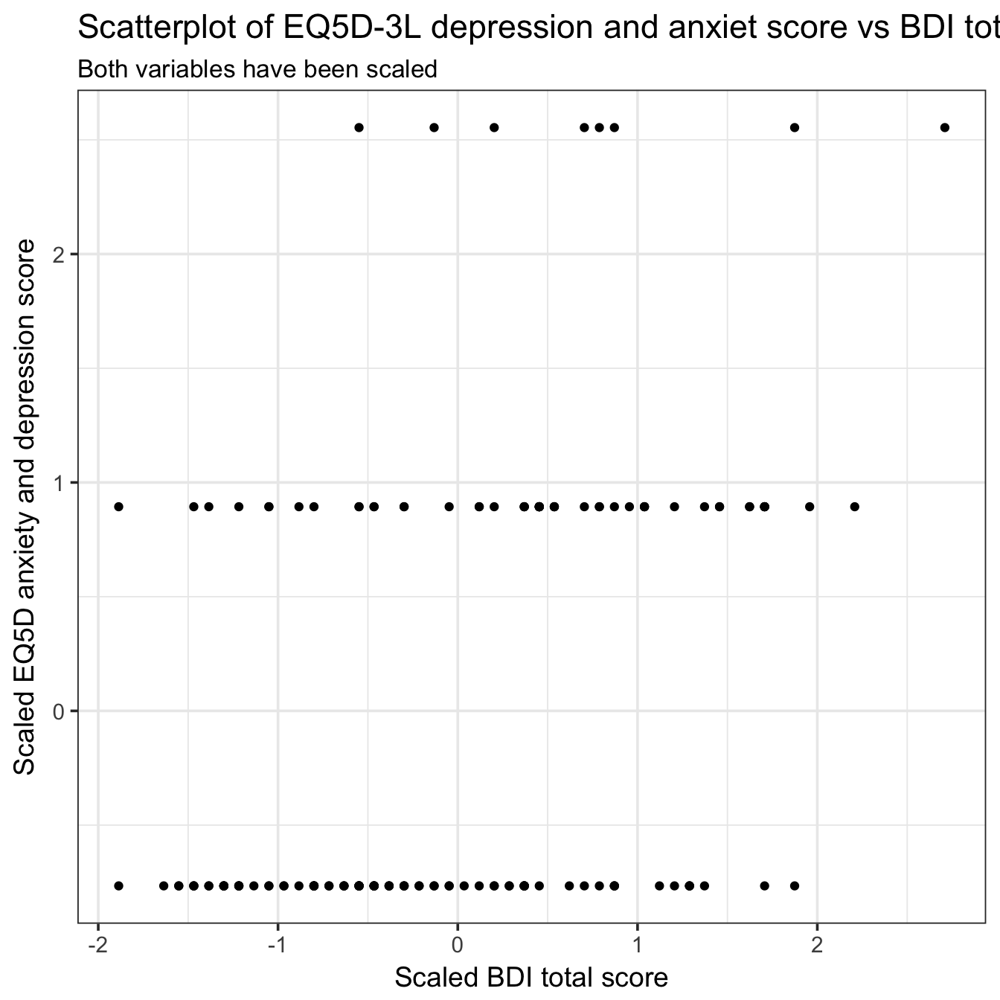

----

Is there correlation between the two assessments of depression and anxiety, the single EQ5D anxiety/depression item or the composite BDI?

Scores were scaled before the correlation was performed.

----

# Import data


```r
# Get BDI
bdi <- read_rds('./data/bdi.rds')

# Get EQ5D
eq5d <- read_rds('./data/eq5d.rds')
```

----

# Quick look


```r
glimpse(bdi)
```

```
## Observations: 160
## Variables: 127
## $ ID                            <chr> "J1", "J3", "J4", "J5", "J6", "J...
## $ Sadness.BL                    <chr> "1", "3", "0", "0", "2", "1", "0...
## $ Sadness.Wk4                   <chr> NA, NA, "0", NA, NA, "0", "0", "...
## $ Sadness.Wk8                   <chr> NA, NA, "0", NA, NA, NA, "1", "0...
## $ Sadness.Wk12                  <chr> NA, NA, "0", NA, NA, NA, "2", "0...
## $ Sadness.Wk24                  <chr> NA, NA, "0", NA, NA, NA, "0", "0...
## $ Sadness.Wk48                  <chr> NA, NA, "0", NA, NA, NA, "1", "1...
## $ Pessimism.BL                  <chr> "2", "3", "0", "1", "0", "0", "0...
## $ Pessimism.Wk4                 <chr> NA, NA, "0", NA, NA, "2", "3", "...
## $ Pessimism.Wk8                 <chr> NA, NA, "0", NA, NA, NA, "0", "0...
## $ Pessimism.Wk12                <chr> NA, NA, "0", NA, NA, NA, "0", "0...
## $ Pessimism.Wk24                <chr> NA, NA, "0", NA, NA, NA, "2", "0...
## $ Pessimism.Wk48                <chr> NA, NA, "0", NA, NA, NA, "0", "0...
## $ Past_failures.BL              <chr> "2", "3", "0", "2", "1", "0", "0...
## $ Past_failures.Wk4             <chr> NA, NA, "0", NA, NA, "0", "0", "...
## $ Past_failures.Wk8             <chr> NA, NA, "0", NA, NA, NA, "0", "0...
## $ Past_failures.Wk12            <chr> NA, NA, "0", NA, NA, NA, "0", "0...
## $ Past_failures.Wk24            <chr> NA, NA, "0", NA, NA, NA, "0", "0...
## $ Past_failures.Wk48            <chr> NA, NA, "0", NA, NA, NA, "0", "0...
## $ Loss_of_pleasure.BL           <chr> "2", "2", "1", "3", "2", "0", "1...
## $ Loss_of_pleasure.Wk4          <chr> NA, NA, "0", NA, NA, "0", "1", "...
## $ Loss_of_pleasure.Wk8          <chr> NA, NA, "0", NA, NA, NA, "1", "1...
## $ Loss_of_pleasure.Wk12         <chr> NA, NA, "0", NA, NA, NA, "1", "0...
## $ Loss_of_pleasure.Wk24         <chr> NA, NA, "1", NA, NA, NA, "1", "1...
## $ Loss_of_pleasure.Wk48         <chr> NA, NA, "1", NA, NA, NA, "1", "1...
## $ Guilty_feelings.BL            <chr> "2", "3", "0", "0", "1", "3", "0...
## $ Guilty_feelings.Wk4           <chr> NA, NA, "0", NA, NA, "2", "2", "...
## $ Guilty_feelings.Wk8           <chr> NA, NA, "0", NA, NA, NA, "0", "0...
## $ Guilty_feelings.Wk12          <chr> NA, NA, "0", NA, NA, NA, "0", "0...
## $ Guilty_feelings.Wk24          <chr> NA, NA, "0", NA, NA, NA, "0", "0...
## $ Guilty_feelings.Wk48          <chr> NA, NA, "0", NA, NA, NA, "1", "0...
## $ Punishment_feelings.BL        <chr> "3", "3", "0", "3", "3", "0", "0...
## $ Punishment_feelings.Wk4       <chr> NA, NA, "0", NA, NA, "0", "0", "...
## $ Punishment_feelings.Wk8       <chr> NA, NA, "0", NA, NA, NA, "0", "0...
## $ Punishment_feelings.Wk12      <chr> NA, NA, "0", NA, NA, NA, "1", "0...
## $ Punishment_feelings.Wk24      <chr> NA, NA, "0", NA, NA, NA, "0", "0...
## $ Punishment_feelings.Wk48      <chr> NA, NA, "0", NA, NA, NA, "0", "0...
## $ Self_dislike.BL               <chr> "1", "2", "0", "1", "1", "0", "0...
## $ Self_dislike.Wk4              <chr> NA, NA, "0", NA, NA, "0", "0", "...
## $ Self_dislike.Wk8              <chr> NA, NA, "0", NA, NA, NA, "0", "0...
## $ Self_dislike.Wk12             <chr> NA, NA, "0", NA, NA, NA, "0", "0...
## $ Self_dislike.Wk24             <chr> NA, NA, "0", NA, NA, NA, "0", "0...
## $ Self_dislike.Wk48             <chr> NA, NA, "0", NA, NA, NA, "0", "0...
## $ Self_critical.BL              <chr> "3", "3", "0", "3", "0", "0", "3...
## $ Self_critical.Wk4             <chr> NA, NA, "0", NA, NA, "0", "0", "...
## $ Self_critical.Wk8             <chr> NA, NA, "0", NA, NA, NA, "0", "0...
## $ Self_critical.Wk12            <chr> NA, NA, "0", NA, NA, NA, "0", "0...
## $ Self_critical.Wk24            <chr> NA, NA, "0", NA, NA, NA, "0", "1...
## $ Self_critical.Wk48            <chr> NA, NA, "0", NA, NA, NA, "0", "0...
## $ Suicidal.BL                   <chr> "3", "1", "0", "0", "1", "0", "0...
## $ Suicidal.Wk4                  <chr> NA, NA, "0", NA, NA, "0", "0", "...
## $ Suicidal.Wk8                  <chr> NA, NA, "0", NA, NA, NA, "0", "0...
## $ Suicidal.Wk12                 <chr> NA, NA, "0", NA, NA, NA, "0", "0...
## $ Suicidal.Wk24                 <chr> NA, NA, "0", NA, NA, NA, "0", "0...
## $ Suicidal.Wk48                 <chr> NA, NA, "0", NA, NA, NA, "1", "0...
## $ Crying.BL                     <chr> "3", "1", "0", "0", "2", "2", "3...
## $ Crying.Wk4                    <chr> NA, NA, "0", NA, NA, "0", "3", "...
## $ Crying.Wk8                    <chr> NA, NA, "0", NA, NA, NA, "1", "0...
## $ Crying.Wk12                   <chr> NA, NA, "3", NA, NA, NA, "3", "3...
## $ Crying.Wk24                   <chr> NA, NA, "3", NA, NA, NA, "3", "3...
## $ Crying.Wk48                   <chr> NA, NA, "0", NA, NA, NA, "1", "0...
## $ Agitation.BL                  <chr> "3", "1", "3", "2", "3", "3", "3...
## $ Agitation.Wk4                 <chr> NA, NA, "0", NA, NA, "0", "0", "...
## $ Agitation.Wk8                 <chr> NA, NA, "0", NA, NA, NA, "0", "3...
## $ Agitation.Wk12                <chr> NA, NA, "0", NA, NA, NA, "1", "3...
## $ Agitation.Wk24                <chr> NA, NA, "2", NA, NA, NA, "3", "3...
## $ Agitation.Wk48                <chr> NA, NA, "2", NA, NA, NA, "2", "3...
## $ Loss_of_interest.BL           <chr> "3", "1", "0", "1", "1", "0", "3...
## $ Loss_of_interest.Wk4          <chr> NA, NA, "0", NA, NA, "0", "1", "...
## $ Loss_of_interest.Wk8          <chr> NA, NA, "0", NA, NA, NA, "0", "0...
## $ Loss_of_interest.Wk12         <chr> NA, NA, "0", NA, NA, NA, "2", "0...
## $ Loss_of_interest.Wk24         <chr> NA, NA, "0", NA, NA, NA, "0", "0...
## $ Loss_of_interest.Wk48         <chr> NA, NA, "0", NA, NA, NA, "0", "0...
## $ Indecisiveness.BL             <chr> "2", "2", "0", "3", "2", "0", "1...
## $ Indecisivenes.Wk4             <chr> NA, NA, "0", NA, NA, "0", "0", "...
## $ Indecisivenes.Wk8             <chr> NA, NA, "0", NA, NA, NA, "0", "0...
## $ Indecisivenes.Wk12            <chr> NA, NA, "0", NA, NA, NA, "1", "0...
## $ Indecisivenes.Wk24            <chr> NA, NA, "0", NA, NA, NA, "1", "0...
## $ Indecisivenes.Wk48            <chr> NA, NA, "0", NA, NA, NA, "0", "0...
## $ Worthlessness.BL              <chr> "2", "3", "1", "2", "2", "0", "0...
## $ Worthlessness.Wk4             <chr> NA, NA, "0", NA, NA, "0", "0", "...
## $ Worthlessness.Wk8             <chr> NA, NA, "0", NA, NA, NA, "0", "0...
## $ Worthlessness.Wk12            <chr> NA, NA, "0", NA, NA, NA, "0", "0...
## $ Worthlessness.Wk24            <chr> NA, NA, "0", NA, NA, NA, "0", "0...
## $ Worthlessness.Wk48            <chr> NA, NA, "0", NA, NA, NA, "0", "0...
## $ Loss_of_energy.BL             <chr> "1", "1", "0", "1", "0", "0", "2...
## $ Loss_of_energy.Wk4            <chr> NA, NA, "0", NA, NA, "0", "1", "...
## $ Loss_of_energy.Wk8            <chr> NA, NA, "0", NA, NA, NA, "1", "1...
## $ Loss_of_energy.Wk12           <chr> NA, NA, "0", NA, NA, NA, "2", "1...
## $ Loss_of_energy.Wk24           <chr> NA, NA, "1", NA, NA, NA, "1", "0...
## $ Loss_of_energy.Wk48           <chr> NA, NA, "1", NA, NA, NA, "1", "0...
## $ Sleep.BL                      <chr> "3", "0", "2", "1", "1", "2", "2...
## $ Sleep.Wk8                     <chr> NA, NA, "2", NA, NA, NA, "2", "3...
## $ Sleep.Wk4                     <chr> NA, NA, "2", NA, NA, "2", "3", "...
## $ Sleep.Wk24                    <chr> NA, NA, "2", NA, NA, NA, "3", "2...
## $ Sleep.Wk12                    <chr> NA, NA, "2", NA, NA, NA, "3", "3...
## $ Irritability.BL               <chr> "2", "3", "0", "1", "2", "3", "1...
## $ Sleep.Wk48                    <chr> NA, NA, "2", NA, NA, NA, "3", "2...
## $ Irritability.Wk4              <chr> NA, NA, "0", NA, NA, "0", "0", "...
## $ Irritability.Wk8              <chr> NA, NA, "0", NA, NA, NA, "0", "0...
## $ Irritability.Wk12             <chr> NA, NA, "0", NA, NA, NA, "0", "0...
## $ Irritability.Wk24             <chr> NA, NA, "1", NA, NA, NA, "1", "0...
## $ Irritability.Wk48             <chr> NA, NA, "2", NA, NA, NA, "3", "1...
## $ Appetite.BL                   <chr> "1", "1", "0", "2", "0", "2", "0...
## $ Appetite.Wk8                  <chr> NA, NA, "2", NA, NA, NA, "0", "3...
## $ Appetite.Wk4                  <chr> NA, NA, "2", NA, NA, "3", "0", "...
## $ Appetite.Wk24                 <chr> NA, NA, "2", NA, NA, NA, "0", "2...
## $ Appetite.Wk12                 <chr> NA, NA, "2", NA, NA, NA, "1", "3...
## $ Concentration_difficulty.BL   <chr> "3", "1", "0", "2", "1", "0", "2...
## $ Appetite.Wk48                 <chr> NA, NA, "3", NA, NA, NA, "2", "2...
## $ Concentration_difficulty.Wk4  <chr> NA, NA, "0", NA, NA, "0", "0", "...
## $ Concentration_difficulty.Wk8  <chr> NA, NA, "0", NA, NA, NA, "0", "0...
## $ Concentration_difficulty.Wk12 <chr> NA, NA, "0", NA, NA, NA, "1", "0...
## $ Concentration_difficulty.Wk24 <chr> NA, NA, "1", NA, NA, NA, "2", "0...
## $ Concentration_difficulty.Wk48 <chr> NA, NA, "0", NA, NA, NA, "1", "0...
## $ Fatigue.BL                    <chr> "2", "0", "0", "1", "0", "2", "1...
## $ Fatigue.Wk4                   <chr> NA, NA, "0", NA, NA, "0", "0", "...
## $ Fatigue.Wk8                   <chr> NA, NA, "0", NA, NA, NA, "1", "0...
## $ Fatigue.Wk12                  <chr> NA, NA, "0", NA, NA, NA, "2", "0...
## $ Fatigue.Wk24                  <chr> NA, NA, "1", NA, NA, NA, "1", "0...
## $ Fatigue.Wk48                  <chr> NA, NA, "0", NA, NA, NA, "1", "1...
## $ Loss_of_interest_in_sex.BL    <chr> "2", "1", "1", "3", "3", "2", "1...
## $ Loss_of_interest_in_sex.Wk4   <chr> NA, NA, "1", NA, NA, "2", "1", "...
## $ Loss_of_interest_in_sex.Wk8   <chr> NA, NA, "0", NA, NA, NA, "1", "1...
## $ Loss_of_interest_in_sex.Wk12  <chr> NA, NA, "1", NA, NA, NA, "2", "1...
## $ Loss_of_interest_in_sex.Wk24  <chr> NA, NA, "1", NA, NA, NA, "1", "1...
## $ Loss_of_interest_in_sex.Wk48  <chr> NA, NA, "1", NA, NA, NA, "2", "1...
```

```r
glimpse(eq5d)
```

```
## Observations: 160
## Variables: 37
## $ ID                          <chr> "J1", "J3", "J4", "J5", "J6", "J7"...
## $ Mobility.BL                 <int> 1, 1, 2, 1, 1, 1, 2, 2, 2, 1, 2, N...
## $ Mobility.Wk4                <int> NA, NA, 1, NA, NA, 1, 1, 1, 1, NA,...
## $ Mobility.Wk8                <int> NA, NA, 1, NA, NA, NA, 1, 2, 2, 1,...
## $ Mobility.Wk12               <int> NA, NA, 1, NA, NA, NA, 1, 2, 2, 1,...
## $ Mobility.Wk24               <int> NA, NA, 1, NA, NA, NA, 2, 1, NA, 1...
## $ Mobility.Wk48               <int> NA, NA, 1, NA, NA, NA, 2, 1, NA, 1...
## $ Self_care.BL                <int> 2, 1, 1, 1, 1, 1, 1, 1, 1, 1, 1, N...
## $ Self_care.Wk4               <int> NA, NA, 1, NA, NA, 1, 1, 1, 1, NA,...
## $ Self_care.Wk8               <int> NA, NA, 1, NA, NA, NA, 1, 1, 1, 1,...
## $ Self_care.Wk12              <int> NA, NA, 1, NA, NA, NA, 1, 1, 1, 1,...
## $ Self_care.Wk24              <int> NA, NA, 1, NA, NA, NA, 1, 1, NA, 1...
## $ Self_care.Wk48              <int> NA, NA, 1, NA, NA, NA, 1, 1, NA, 1...
## $ Usual_activities.BL         <int> 2, 1, 1, 1, 2, 2, 1, 1, 2, 1, 2, N...
## $ Usual_activities.Wk4        <int> NA, NA, 1, NA, NA, 1, 1, 1, 1, NA,...
## $ Usual_activities.Wk8        <int> NA, NA, 1, NA, NA, NA, 1, 1, 3, 2,...
## $ Usual_activities.Wk12       <int> NA, NA, 1, NA, NA, NA, 1, 1, 3, 2,...
## $ Usual_activities.Wk24       <int> NA, NA, 2, NA, NA, NA, 2, 1, NA, 1...
## $ Usual_activities.Wk48       <int> NA, NA, 1, NA, NA, NA, 2, 1, NA, 1...
## $ Pain.BL                     <int> NA, 3, 2, 3, 1, 3, 2, 3, 3, 1, 3, ...
## $ Pain.Wk4                    <int> NA, NA, 1, NA, NA, 3, 2, 3, 3, NA,...
## $ Pain.Wk8                    <int> NA, NA, 1, NA, NA, NA, 2, 3, 3, 2,...
## $ Pain.Wk12                   <int> NA, NA, 2, NA, NA, NA, 2, 3, 3, 2,...
## $ Pain.Wk24                   <int> NA, NA, 2, NA, NA, NA, 3, 3, NA, 2...
## $ Pain.Wk48                   <int> NA, NA, 2, NA, NA, NA, 3, 2, NA, 2...
## $ Anxiety_and_depression.BL   <int> 2, 1, 1, 1, 2, 1, 1, 1, 1, 1, 1, N...
## $ Anxiety_and_depression.Wk4  <int> NA, NA, 1, NA, NA, 1, 2, 1, 1, NA,...
## $ Anxiety_and_depression.Wk8  <int> NA, NA, 1, NA, NA, NA, 2, 1, 1, 1,...
## $ Anxiety_and_depression.Wk12 <int> NA, NA, 1, NA, NA, NA, 1, 1, 1, 1,...
## $ Anxiety_and_depression.Wk24 <int> NA, NA, 1, NA, NA, NA, 1, 1, NA, 1...
## $ Anxiety_and_depression.Wk48 <int> NA, NA, 1, NA, NA, NA, 1, 1, NA, 1...
## $ State_of_health.BL          <int> 60, 0, 80, 60, 80, 80, 20, 60, 30,...
## $ State_of_health.Wk4         <int> NA, NA, 90, NA, NA, 80, 60, 60, 80...
## $ State_of_health.Wk8         <int> NA, NA, 80, NA, NA, NA, 30, 70, 40...
## $ State_of_health.Wk12        <int> NA, NA, 90, NA, NA, NA, 30, 80, 20...
## $ State_of_health.Wk24        <int> NA, NA, 80, NA, NA, NA, 50, 80, NA...
## $ State_of_health.Wk48        <int> NA, NA, 80, NA, NA, NA, 60, 60, NA...
```

----

# Clean data


```r
# BDI 
bdi %<>%
    select(ID, ends_with('BL')) %>% 
    mutate_at(.vars = 2:22,
              .funs = as.integer) %>% 
    mutate(bdi_score = rowSums(x = .[2:22])) %>% 
    select(ID, bdi_score)


# EQ5D
eq5d %<>% 
    select(ID, ends_with('Anxiety_and_depression.BL'))

# Join objects
data <- eq5d %>%
    left_join(bdi) %>%
    # Rename columns
    rename(eq5d_score = Anxiety_and_depression.BL) %>%
    # Normalise data
    mutate(bdi_score = as.vector(scale(bdi_score)),
           eq5d_score = as.vector(scale(eq5d_score))) %>%
    # Filter incomplete cases
    filter(complete.cases(.))
```

----

# Exploratory plots


```r
# Plot
ggplot(data = data) +
    aes(x = bdi_score,
        y = eq5d_score) +
    geom_point() +
    labs(title = 'Scatterplot of EQ5D-3L depression and anxiet score vs BDI total score',
         subtitle = 'Both variables have been scaled',
         x = 'Scaled BDI total score',
         y = 'Scaled EQ5D anxiety and depression score')
```



----

# Correlation analysis


```r
cor.test(y = data$eq5d_score,
         x = data$bdi_score,
         method = 'spearman')
```

```
## 
## 	Spearman's rank correlation rho
## 
## data:  data$bdi_score and data$eq5d_score
## S = 276870, p-value = 1.408e-06
## alternative hypothesis: true rho is not equal to 0
## sample estimates:
##       rho 
## 0.3945652
```

----

There is a weak positive correlation between the two scores.

----

# Session information


```
## R version 3.4.3 (2017-11-30)
## Platform: x86_64-apple-darwin15.6.0 (64-bit)
## Running under: macOS High Sierra 10.13.3
## 
## Matrix products: default
## BLAS: /Library/Frameworks/R.framework/Versions/3.4/Resources/lib/libRblas.0.dylib
## LAPACK: /Library/Frameworks/R.framework/Versions/3.4/Resources/lib/libRlapack.dylib
## 
## locale:
## [1] en_GB.UTF-8/en_GB.UTF-8/en_GB.UTF-8/C/en_GB.UTF-8/en_GB.UTF-8
## 
## attached base packages:
## [1] stats     graphics  grDevices utils     datasets  methods   base     
## 
## other attached packages:
##  [1] bindrcpp_0.2       skimr_1.0.1        forcats_0.3.0     
##  [4] stringr_1.3.0      dplyr_0.7.4        purrr_0.2.4       
##  [7] readr_1.1.1        tidyr_0.8.0        tibble_1.4.2      
## [10] ggplot2_2.2.1.9000 tidyverse_1.2.1    magrittr_1.5      
## 
## loaded via a namespace (and not attached):
##  [1] tidyselect_0.2.4  reshape2_1.4.3    pander_0.6.1     
##  [4] haven_1.1.1       lattice_0.20-35   colorspace_1.3-2 
##  [7] htmltools_0.3.6   yaml_2.1.17       rlang_0.2.0      
## [10] pillar_1.2.1      foreign_0.8-69    glue_1.2.0       
## [13] modelr_0.1.1      readxl_1.0.0      bindr_0.1        
## [16] plyr_1.8.4        munsell_0.4.3     gtable_0.2.0     
## [19] cellranger_1.1.0  rvest_0.3.2       psych_1.7.8      
## [22] evaluate_0.10.1   labeling_0.3      knitr_1.20       
## [25] parallel_3.4.3    broom_0.4.3       Rcpp_0.12.15     
## [28] scales_0.5.0.9000 backports_1.1.2   jsonlite_1.5     
## [31] mnormt_1.5-5      hms_0.4.1         digest_0.6.15    
## [34] stringi_1.1.6     grid_3.4.3        rprojroot_1.3-2  
## [37] cli_1.0.0         tools_3.4.3       lazyeval_0.2.1   
## [40] crayon_1.3.4      pkgconfig_2.0.1   xml2_1.2.0       
## [43] lubridate_1.7.3   assertthat_0.2.0  rmarkdown_1.9    
## [46] httr_1.3.1        rstudioapi_0.7    R6_2.2.2         
## [49] nlme_3.1-131.1    compiler_3.4.3
```
