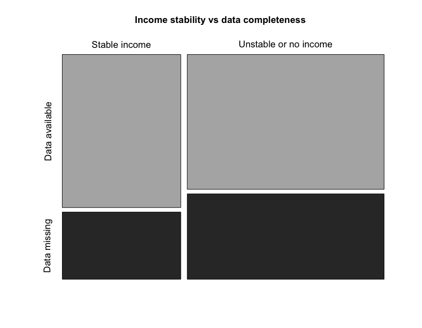
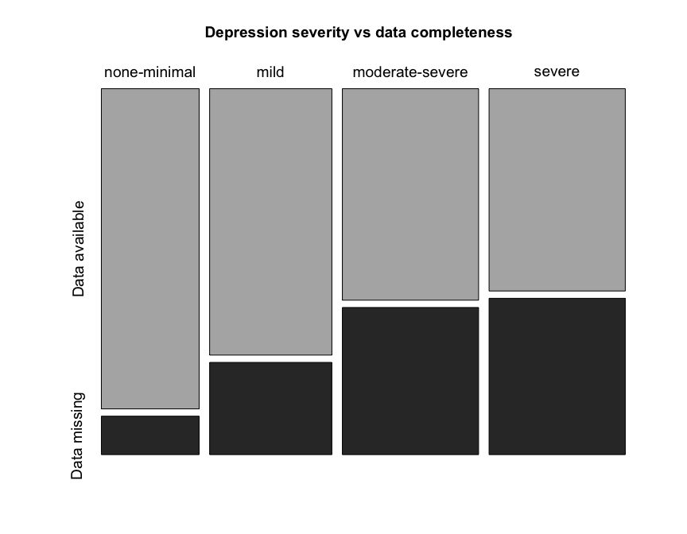
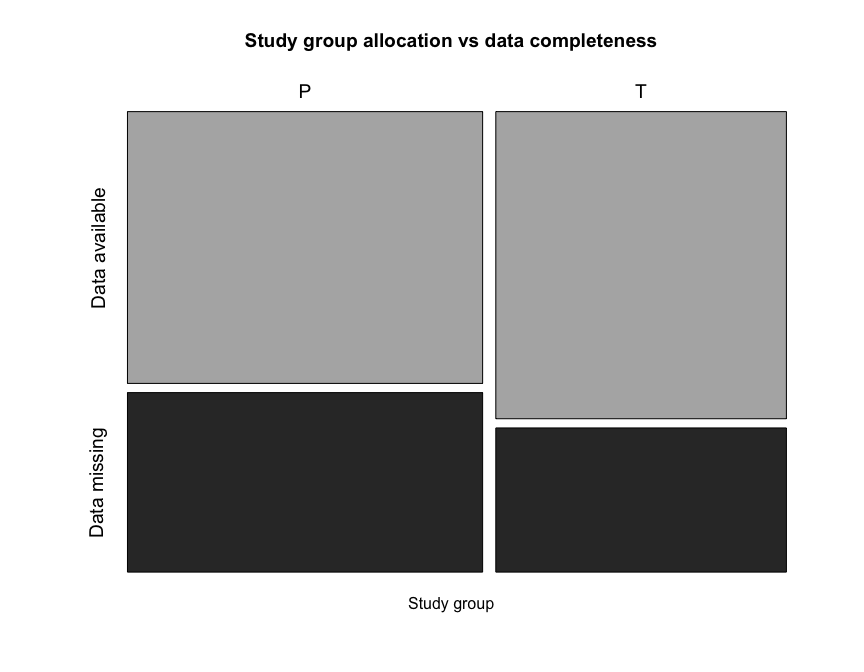
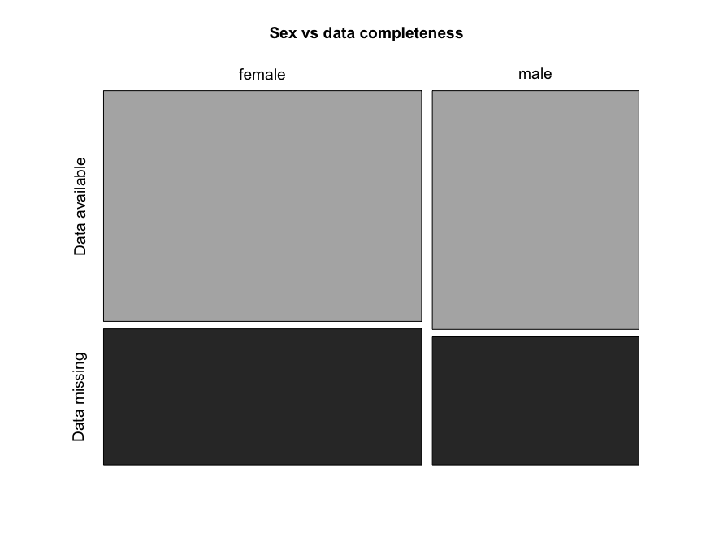
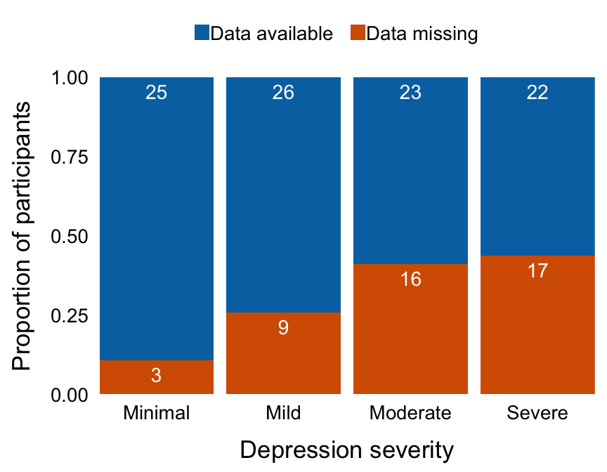
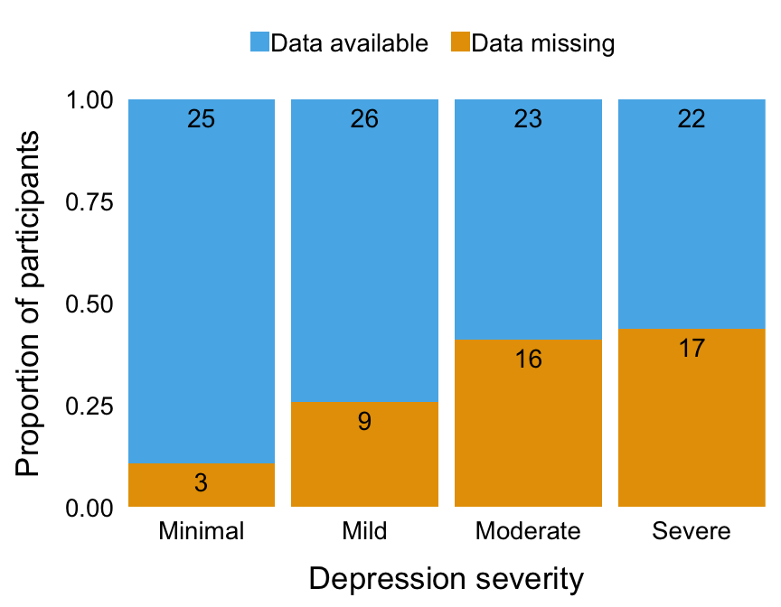
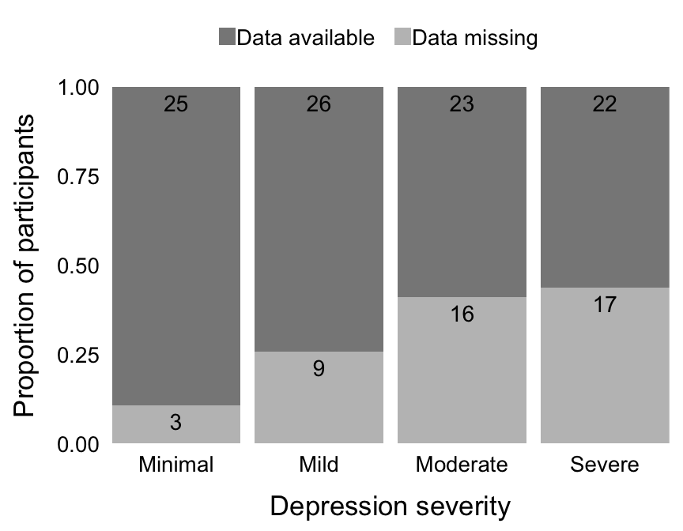

----

We assessed four predictors of dropout (employment status, depression, study group allocation, and sex) from the study by week 8. Week 8 is the time point 2 weeks after the completion on the 6 week programme. 

----

# Import data


```r
# Get data
## BPI
bpi <- read_rds('data-cleaned/bpi.rds') %>% 
    select(ID, Pain_present.Wk8)

## Demographics
demo <- read_rds('data-cleaned/demographics.rds') %>% 
    select(ID, Study_site, Group, Sex, Occupation)

## BDI
bdi <- read_rds('data-cleaned/bdi.rds') %>% 
    select(ID, ends_with('BL'))
```

----

# Quick look


```r
glimpse(bpi)
```

```
## Observations: 160
## Variables: 2
## $ ID               <chr> "J1", "J3", "J4", "J5", "J6", "J7", "J9", "J10"…
## $ Pain_present.Wk8 <chr> NA, NA, "Yes", NA, NA, NA, "Yes", "Yes", "Yes",…
```

```r
glimpse(demo)
```

```
## Observations: 160
## Variables: 5
## $ ID         <chr> "J1", "J3", "J4", "J5", "J6", "J7", "J9", "J10", "J11…
## $ Study_site <chr> "U1", "U1", "U1", "U1", "U1", "U1", "U1", "U1", "U1",…
## $ Group      <chr> "P", "T", "P", "P", "P", "T", "T", "T", "P", "T", "T"…
## $ Sex        <chr> "female", "female", "female", "female", "female", "fe…
## $ Occupation <chr> "employed", NA, "employed", "unemployed - looking for…
```

```r
glimpse(bdi)
```

```
## Observations: 160
## Variables: 22
## $ ID                          <chr> "J1", "J3", "J4", "J5", "J6", "J7", …
## $ Sadness.BL                  <int> 1, 3, 0, 0, 2, 1, 0, 1, 3, 0, 3, NA,…
## $ Pessimism.BL                <int> 2, 3, 0, 1, 0, 0, 0, 0, 0, 1, 2, NA,…
## $ Past_failures.BL            <int> 2, 3, 0, 2, 1, 0, 0, 0, 2, 0, 0, NA,…
## $ Loss_of_pleasure.BL         <int> 2, 2, 1, 3, 2, 0, 1, 1, 2, 1, 0, NA,…
## $ Guilty_feelings.BL          <int> 2, 3, 0, 0, 1, 3, 0, 0, 2, 0, 0, NA,…
## $ Punishment_feelings.BL      <int> 3, 3, 0, 3, 3, 0, 0, 0, 3, 0, 0, NA,…
## $ Self_dislike.BL             <int> 1, 2, 0, 1, 1, 0, 0, 0, 2, 0, 0, NA,…
## $ Self_critical.BL            <int> 3, 3, 0, 3, 0, 0, 3, 0, 3, 0, 3, NA,…
## $ Suicidal.BL                 <int> 3, 1, 0, 0, 1, 0, 0, 0, 0, 0, 0, NA,…
## $ Crying.BL                   <int> 3, 1, 0, 0, 2, 2, 3, 0, 3, 0, 3, NA,…
## $ Agitation.BL                <int> 3, 1, 3, 2, 3, 3, 3, 3, 3, 0, 3, NA,…
## $ Loss_of_interest.BL         <int> 3, 1, 0, 1, 1, 0, 3, 0, 0, 0, 0, NA,…
## $ Indecisiveness.BL           <int> 2, 2, 0, 3, 2, 0, 1, 0, 0, 0, 0, NA,…
## $ Worthlessness.BL            <int> 2, 3, 1, 2, 2, 0, 0, 1, 0, 0, 0, NA,…
## $ Loss_of_energy.BL           <int> 1, 1, 0, 1, 0, 0, 2, 1, 2, 0, 2, NA,…
## $ Sleep.BL                    <int> 3, 0, 2, 1, 1, 2, 2, 2, 3, 2, 2, NA,…
## $ Irritability.BL             <int> 2, 3, 0, 1, 2, 3, 1, 0, 1, 0, 2, NA,…
## $ Appetite.BL                 <int> 1, 1, 0, 2, 0, 2, 0, 3, 3, 2, 0, NA,…
## $ Concentration_difficulty.BL <int> 3, 1, 0, 2, 1, 0, 2, 0, 0, 0, 0, NA,…
## $ Fatigue.BL                  <int> 2, 0, 0, 1, 0, 2, 1, 0, 3, 1, 2, NA,…
## $ Loss_of_interest_in_sex.BL  <int> 2, 1, 1, 3, 3, 2, 1, 1, 3, 1, 0, NA,…
```

----

# Clean data


```r
############################################################
#                                                          #
#                           BPI                            #
#                                                          #
############################################################
# Recode whether there is pain data at week 8 (data completeness)
bpi %<>% 
    select(ID, Pain_present.Wk8) %>% 
    mutate(coding = ifelse(is.na(Pain_present.Wk8), 
                           yes = 'Data missing',
                           no = 'Data available')) %>% 
    select(-Pain_present.Wk8)

############################################################
#                                                          #
#                       Demographics                       #
#                                                          #
############################################################
# Mutate new column to reclassify employment status into income grouping
# Employment status was recoded as stable income (employed or on a grant) 
# or unstable income (all other categories, including being a student).
demo %<>%
    mutate(income_stability = case_when(
        Occupation == "employed" | 
            Occupation == "unable to work - disability grant" ~ "Stable income",
        Occupation == "student/volunteer" | 
            Occupation == "unemployed - looking for work" | 
            Occupation == "unemployed - not looking for work" ~ "Unstable or no income"
        )) %>% 
    select(ID, Study_site, Group, Sex, income_stability)

# Join with completeness ('bpi') data
demo %<>% 
    left_join(bpi)

############################################################
#                                                          #
#                           BDI                            #
#                                                          #
############################################################
# Calculate BDI total score
bdi %<>% 
    mutate_at(.vars = 2:22,
              .funs = as.integer) %>%
    mutate(Total.BL = rowSums(.[2:22])) 

# Join with demo to get site info
bdi %<>%
    left_join(demo) %>%
    select(ID, Study_site, Total.BL)

# Convert total BDI scores into categories 
## Site U1 used BDI II
## Site U2, R1, and R2 used BDI I
bdi %<>% 
    mutate(bdi_category = case_when(
    Study_site == "U1" & Total.BL <= 13 ~ "none-minimal",
    Study_site == "U1" & Total.BL > 13 & Total.BL <= 19 ~ "mild",
    Study_site == "U1" & Total.BL > 19 & Total.BL <= 28 ~ "moderate-severe",
    Study_site == "U1" & Total.BL > 28 ~ "severe",
    Study_site != "U1" & Total.BL <= 9 ~ "none-minimal",
    Study_site != "U1" & Total.BL > 9 & Total.BL <= 18 ~ "mild",
    Study_site != "U1" & Total.BL > 18 & Total.BL <= 29 ~ "moderate-severe",
    Study_site != "U1" & Total.BL > 29 ~ "severe"))

# Convert bdi category into an ordered factor
bdi %<>% mutate(bdi_category = factor(bdi_category, 
                                      levels = c("none-minimal", 
                                                 "mild", 
                                                 "moderate-severe", 
                                                 "severe"), 
                                      ordered = TRUE))
# Drop Site column
bdi %<>% 
    select(-Study_site)

# Join with completeness ('bpi') data
bdi %<>% 
    left_join(bpi)
```

----

# Employment/income stability

### Tabulate 

_(no stratification by study site)_


```r
demo %>% group_by(income_stability) %>%
    summarise(count = n()) %>% 
    kable(., caption = 'Access to stable income',
          col.names = c('', 'Count'))
```


Table: Access to stable income

                         Count
----------------------  ------
NA                           3
Stable income               59
Unstable or no income       98

### Null hypothesis significance testing (NHST)


```r
# xtabulate the data
employ <- xtabs(~ income_stability + coding, 
                data = demo)

# Produce mosaic plot
mosaicplot(employ,
           main = 'Income stability vs data completeness',
           xlab = '',
           ylab = '',
           cex = 1.2, 
           color = c('#B2B2B2', '#323232'))
```



```r
# Fishers exact test
kable(tidy(fisher.test(employ)),
      caption = 'Association between income stability and data completeness',
      col.names = c('Estimate', 'p-value', 
                    'Lower 95% CI', 'Upper 95% CI',
                    'Method', 'Alternative'),
      digits = 3)
```


Table: Association between income stability and data completeness

 Estimate   p-value   Lower 95% CI   Upper 95% CI  Method                               Alternative 
---------  --------  -------------  -------------  -----------------------------------  ------------
    1.439     0.309          0.691          3.067  Fisher's Exact Test for Count Data   two.sided   

----

# Depression and anxiety

### Tabulate 

_(no stratification by study site)_


```r
bdi %>% group_by(bdi_category) %>%
    summarise(count = n()) %>% 
    kable(., caption = 'BDI severity category',
          col.names = c('', 'Count'))
```


Table: BDI severity category

                   Count
----------------  ------
none-minimal          28
mild                  35
moderate-severe       39
severe                39
NA                    19

### Null hypothesis significance testing (NHST)


```r
# xtabulate the data
depression <- xtabs(~ bdi_category + coding, 
                    data = bdi)

# Produce mosaic plot
mosaicplot(depression,
           main = 'Depression severity vs data completeness',
           xlab = '',
           ylab = '',
           cex = 1.2, 
           color = c('#B2B2B2', '#323232'))
```



```r
# Logistic regression on ordered independent variable 
model <- glm(factor(coding) ~ bdi_category, 
             data = bdi, 
             family = binomial(link = "logit"))

# Model summary
Anova(model)
```

```
## Analysis of Deviance Table (Type II tests)
## 
## Response: factor(coding)
##              LR Chisq Df Pr(>Chisq)   
## bdi_category     11.4  3    0.00975 **
## ---
## Signif. codes:  0 '***' 0.001 '**' 0.01 '*' 0.05 '.' 0.1 ' ' 1
```

```r
# Model summary
summary(model)
```

```
## 
## Call:
## glm(formula = factor(coding) ~ bdi_category, family = binomial(link = "logit"), 
##     data = bdi)
## 
## Deviance Residuals: 
##    Min      1Q  Median      3Q     Max  
## -1.070  -1.028  -0.771   1.289   2.114  
## 
## Coefficients:
##                Estimate Std. Error z value Pr(>|z|)    
## (Intercept)    -0.95047    0.21406  -4.440 8.99e-06 ***
## bdi_category.L  1.40543    0.47717   2.945  0.00323 ** 
## bdi_category.Q -0.47716    0.42812  -1.115  0.26504    
## bdi_category.C -0.05176    0.37266  -0.139  0.88954    
## ---
## Signif. codes:  0 '***' 0.001 '**' 0.01 '*' 0.05 '.' 0.1 ' ' 1
## 
## (Dispersion parameter for binomial family taken to be 1)
## 
##     Null deviance: 176.6  on 140  degrees of freedom
## Residual deviance: 165.2  on 137  degrees of freedom
##   (19 observations deleted due to missingness)
## AIC: 173.2
## 
## Number of Fisher Scoring iterations: 4
```

```r
# Print odds ratios
ci <- exp(confint(model))[c(-1, -4)]
oddR <- tibble('Item' = names(exp(coef(model))[-1]),
               'Odds ratio' = round(exp(coef(model))[-1], 3),
               'Lower 95% CI' = round(ci[1:3], 3),
               'Upper 95% CI' = round(ci[4:6], 3))

kable(oddR,
      caption = 'Odds ratio of regression coefficients')
```


Table: Odds ratio of regression coefficients

Item              Odds ratio   Lower 95% CI   Upper 95% CI
---------------  -----------  -------------  -------------
bdi_category.L         4.077          1.718         11.754
bdi_category.Q         0.621          0.252          1.393
bdi_category.C         0.950          0.575          1.968

----

# Study group allocation

### Tabulate 

_(no stratification by study site)_


```r
demo %>% group_by(Group) %>%
    summarise(count = n()) %>% 
    kable(., caption = 'Study group allocation',
          col.names = c('', 'Count'))
```


Table: Study group allocation

      Count
---  ------
P        88
T        72

### Null hypothesis significance testing (NHST)


```r
# xtabulate the data
group <- xtabs(~ Group + coding,  
               data = demo)

# Produce mosaic plot
mosaicplot(group,
           main = 'Study group allocation vs data completeness',
           xlab = 'Study group',
           ylab = '',
           cex = 1.2, 
           color = c('#B2B2B2', '#323232'))
```



```r
# Fishers exact test
kable(tidy(fisher.test(group)),
      caption = 'Association between study group allocation and data completeness',
      col.names = c('Estimate', 'p-value', 
                    'Lower 95% CI', 'Upper 95% CI',
                    'Method', 'Alternative'),
      digits = 3)
```


Table: Association between study group allocation and data completeness

 Estimate   p-value   Lower 95% CI   Upper 95% CI  Method                               Alternative 
---------  --------  -------------  -------------  -----------------------------------  ------------
    0.712     0.326           0.35          1.435  Fisher's Exact Test for Count Data   two.sided   

---- 

# Sex

### Tabulate 

_(no stratification by study site)_


```r
demo %>% group_by(Sex) %>%
    summarise(count = n()) %>% 
    kable(., caption = 'Sex',
          col.names = c('', 'Count'))
```


Table: Sex

          Count
-------  ------
female       97
male         63

### Null hypothesis significance testing (NHST)


```r
# xtabulate the data
sex <- xtabs(~ Sex + coding,  
               data = demo)

# Produce mosaic plot
mosaicplot(sex,
           main = 'Sex vs data completeness',
           xlab = '',
           ylab = '',
           cex = 1.2, 
           color = c('#B2B2B2', '#323232'))
```



```r
# Fishers exact test
kable(tidy(fisher.test(sex)),
      caption = 'Association between sex and data completeness',
      col.names = c('Estimate', 'p-value', 
                    'Lower 95% CI', 'Upper 95% CI',
                    'Method', 'Alternative'),
      digits = 3)
```


Table: Association between sex and data completeness

 Estimate   p-value   Lower 95% CI   Upper 95% CI  Method                               Alternative 
---------  --------  -------------  -------------  -----------------------------------  ------------
     0.91     0.867          0.442           1.85  Fisher's Exact Test for Count Data   two.sided   

----

# Summary

Income stability, sex, and group allocation did not predict whether or not an individual's data were present at 8 weeks.  However, depression did: those with greater depression (on BDI) were more likely to have been lost to follow-up at the 8-week time point (main effect of depression severity: likelihood ratio = 11.31, df = 3, p = 0.01; OR for linear component of logistic regression = 4.01, 95% CI = 1.68 - 11.59).


```r
#-- Manuscript plot --#
# Plot of proportion of participants with missing data at each level of 
# depression severity, as rated on the Beck's Depression Inventory. 
# Numbers in the blocks show the absolute counts. 
# Note: 19 participants are missing baseline BDI data, so n = 141

# Colour (dark)
p1 <- bdi %>% 
    filter(!is.na(bdi_category)) %>% 
    mutate(bdi_category = fct_recode(bdi_category,
                                     Minimal = 'none-minimal',
                                     Mild = 'mild',
                                     Moderate = 'moderate-severe',
                                     Severe = 'severe'),
           coding = case_when(
               coding == 'Data available' ~ 'Data available   ',
               coding == 'Data missing' ~ 'Data missing    '
               )) %>% 
    ggplot(data = .) +
    aes(bdi_category,
        fill = coding) +
    geom_bar(position = position_fill()) +
    geom_text(stat = 'count',
              position = position_fill(),
              aes(label = ..count..),
              colour = '#FFFFFF',
              vjust = 1.5,
              size = 7.5) +
    labs(x = 'Depression severity',
         y = 'Proportion of participants') +
    scale_x_discrete(expand = c(0, 0)) +
    scale_y_continuous(expand = c(0, 0)) +
    scale_fill_manual(values = c('#0072B2', '#D55E00')) +
    theme_bw(base_size = 26) +
    theme(legend.position = 'top',
          legend.title = element_blank(),
          panel.border = element_blank(),
          panel.grid = element_blank(),
          axis.title.y = element_text(margin = margin(t = 0, r = 20, b = 0, l = 0)),
          axis.title.x = element_text(margin = margin(t = 20, r = 0, b = 0, l = 0)),
          axis.text = element_text(colour = '#000000'),
          axis.line = element_blank(),
          axis.ticks = element_blank()); p1
```



```r
ggsave(filename = 'figures/figure-2_colourA.pdf',
       plot = p1,
       height = 8, 
       width = 10, 
       units = 'in')

# Colour (light)
p2 <- bdi %>% 
    filter(!is.na(bdi_category)) %>% 
    mutate(bdi_category = fct_recode(bdi_category,
                                     Minimal = 'none-minimal',
                                     Mild = 'mild',
                                     Moderate = 'moderate-severe',
                                     Severe = 'severe'),
           coding = case_when(
               coding == 'Data available' ~ 'Data available   ',
               coding == 'Data missing' ~ 'Data missing    '
               )) %>% 
    ggplot(data = .) +
    aes(bdi_category,
        fill = coding) +
    geom_bar(position = position_fill()) +
    geom_text(stat = 'count',
              position = position_fill(),
              aes(label = ..count..),
              colour = '#000000',
              vjust = 1.5,
              size = 7.5) +
    labs(x = 'Depression severity',
         y = 'Proportion of participants') +
    scale_x_discrete(expand = c(0, 0)) +
    scale_y_continuous(expand = c(0, 0)) +
    scale_fill_manual(values = c('#56B4E9', '#E69F00')) +
    theme_bw(base_size = 26) +
    theme(legend.position = 'top',
          legend.title = element_blank(),
          panel.border = element_blank(),
          panel.grid = element_blank(),
          axis.title.y = element_text(margin = margin(t = 0, r = 20, b = 0, l = 0)),
          axis.title.x = element_text(margin = margin(t = 20, r = 0, b = 0, l = 0)),
          axis.text = element_text(colour = '#000000'),
          axis.line = element_blank(),
          axis.ticks = element_blank()); p2
```



```r
ggsave(filename = 'figures/figure-2_colourB.pdf',
       plot = p2,
       height = 8, 
       width = 10, 
       units = 'in')

# Greyscale
p3 <- bdi %>% 
    filter(!is.na(bdi_category)) %>% 
    mutate(bdi_category = fct_recode(bdi_category,
                                     Minimal = 'none-minimal',
                                     Mild = 'mild',
                                     Moderate = 'moderate-severe',
                                     Severe = 'severe'),
           coding = case_when(
               coding == 'Data available' ~ 'Data available   ',
               coding == 'Data missing' ~ 'Data missing    '
               )) %>% 
    ggplot(data = .) +
    aes(bdi_category,
        fill = coding) +
    geom_bar(position = position_fill()) +
    geom_text(stat = 'count',
              position = position_fill(),
              aes(label = ..count..),
              colour = '#000000',
              vjust = 1.5,
              size = 7.5) +
    labs(x = 'Depression severity',
         y = 'Proportion of participants') +
    scale_x_discrete(expand = c(0, 0)) +
    scale_y_continuous(expand = c(0, 0)) +
    scale_fill_manual(values = c('#888888', '#BFBFBF')) +
    theme_bw(base_size = 26) +
    theme(legend.position = 'top',
          legend.title = element_blank(),
          panel.border = element_blank(),
          panel.grid = element_blank(),
          axis.title.y = element_text(margin = margin(t = 0, r = 20, b = 0, l = 0)),
          axis.title.x = element_text(margin = margin(t = 20, r = 0, b = 0, l = 0)),
          axis.text = element_text(colour = '#000000'),
          axis.line = element_blank(),
          axis.ticks = element_blank()); p3
```



```r
ggsave(filename = 'figures/figure-2_greyscale.pdf',
       plot = p3,
       height = 8, 
       width = 10, 
       units = 'in')
```

----

# Session information


```
## R version 3.6.0 (2019-04-26)
## Platform: x86_64-apple-darwin15.6.0 (64-bit)
## Running under: macOS Mojave 10.14.4
## 
## Matrix products: default
## BLAS:   /Library/Frameworks/R.framework/Versions/3.6/Resources/lib/libRblas.0.dylib
## LAPACK: /Library/Frameworks/R.framework/Versions/3.6/Resources/lib/libRlapack.dylib
## 
## locale:
## [1] en_US.UTF-8/en_US.UTF-8/en_US.UTF-8/C/en_US.UTF-8/en_US.UTF-8
## 
## attached base packages:
## [1] stats     graphics  grDevices utils     datasets  methods   base     
## 
## other attached packages:
##  [1] car_3.0-2       carData_3.0-2   knitr_1.22      broom_0.5.2    
##  [5] forcats_0.4.0   stringr_1.4.0   dplyr_0.8.0.1   purrr_0.3.2    
##  [9] readr_1.3.1     tidyr_0.8.3     tibble_2.1.1    ggplot2_3.1.1  
## [13] tidyverse_1.2.1 magrittr_1.5   
## 
## loaded via a namespace (and not attached):
##  [1] tidyselect_0.2.5  xfun_0.6          haven_2.1.0      
##  [4] lattice_0.20-38   colorspace_1.4-1  generics_0.0.2   
##  [7] htmltools_0.3.6   yaml_2.2.0        utf8_1.1.4       
## [10] rlang_0.3.4       pillar_1.3.1      foreign_0.8-71   
## [13] glue_1.3.1        withr_2.1.2.9000  modelr_0.1.4     
## [16] readxl_1.3.1      plyr_1.8.4        munsell_0.5.0    
## [19] gtable_0.3.0      cellranger_1.1.0  zip_2.0.1        
## [22] rvest_0.3.3       evaluate_0.13     labeling_0.3     
## [25] rio_0.5.16        curl_3.3          fansi_0.4.0      
## [28] highr_0.8         Rcpp_1.0.1        scales_1.0.0     
## [31] backports_1.1.4   jsonlite_1.6      abind_1.4-5      
## [34] hms_0.4.2         digest_0.6.18     openxlsx_4.1.0   
## [37] stringi_1.4.3     grid_3.6.0        cli_1.1.0        
## [40] tools_3.6.0       lazyeval_0.2.2    crayon_1.3.4     
## [43] pkgconfig_2.0.2   MASS_7.3-51.4     data.table_1.12.2
## [46] xml2_1.2.0        lubridate_1.7.4   assertthat_0.2.1 
## [49] rmarkdown_1.12    httr_1.4.0        rstudioapi_0.10  
## [52] R6_2.4.0          nlme_3.1-139      compiler_3.6.0
```
