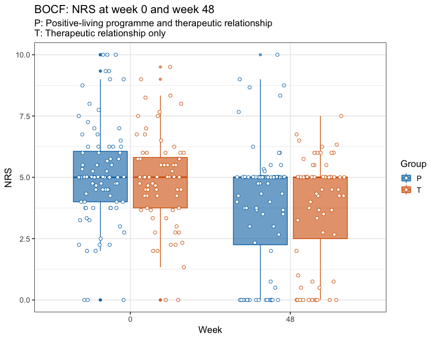

----

The primary outcome was the reduction in pain severity score (PSS) between week 0 (BL) and week 48 (Wk48). The PSS is a composite measure of the mean of: pain at the assessment, and worst, least, and average pain in the last week. 

The baseline observation carried forward (BOCF) analysis used data from week 0 to interpolate missing week 48 data. Some participants did not arrive for their week 0 appointment and therefore did not have data at baseline. These missing data were interpolated using the week 0 study site average PSS. No heed was paid to whether data were available at intermediate time points between week 0 and week 48.

The per protocol (PP) analysis included all individuals with complete data (i.e., no interpolation required).

Statistical significance was assessed using a permutation test that tested the independence of the therapeutic relationship only group (T, control) and the P groups (positive-living programme and therapeutic relationship). The conditional null distribution of the test statistic was calculated using Monte Carlo resampling (n = 100000).

Dosage was calculated as the median number of assessments attended. 

----

# Import and sort data


```r
# Get BPI data
## BPI
bpi <- read_rds('data-cleaned/bpi.rds') %>% 
    select(ID, contains('Pain')) 

## Demographics
demo <- read_rds('data-cleaned/demographics.rds') %>% 
    select(ID, Study_site, Group)

## Join BPI and demographics
data <- demo %>% 
    left_join(bpi)

## Primary outcome
primary <- data %>% 
    select(-contains('present'))
```

----

# Quick look


```r
glimpse(primary)
```

```
## Observations: 160
## Variables: 27
## $ ID                <chr> "J1", "J3", "J4", "J5", "J6", "J7", "J9", "J10…
## $ Study_site        <chr> "U1", "U1", "U1", "U1", "U1", "U1", "U1", "U1"…
## $ Group             <chr> "P", "T", "P", "P", "P", "T", "T", "T", "P", "…
## $ Worst_pain.BL     <int> 8, 9, 5, 7, 7, 8, 10, 10, 9, 0, 10, NA, 9, 8, …
## $ Worst_pain.Wk4    <int> NA, NA, 3, NA, NA, 8, 8, 9, 8, NA, NA, NA, 8, …
## $ Worst_pain.Wk8    <int> NA, NA, 0, NA, NA, NA, 8, 9, 10, 4, NA, NA, 9,…
## $ Worst_pain.Wk12   <int> NA, NA, 3, NA, NA, NA, 7, 9, 10, 7, 10, NA, NA…
## $ Worst_pain.Wk24   <int> NA, NA, 6, NA, NA, NA, 7, 9, NA, 6, NA, NA, NA…
## $ Worst_pain.Wk48   <int> NA, NA, 6, NA, NA, NA, 7, 8, NA, 8, NA, NA, NA…
## $ Least_pain.BL     <int> 4, 1, 1, 10, 2, 3, 3, 5, 3, 0, 3, NA, 3, 3, 2,…
## $ Least_pain.Wk4    <int> NA, NA, 1, NA, NA, 3, 5, 4, 2, NA, NA, NA, 3, …
## $ Least_pain.Wk8    <int> NA, NA, 0, NA, NA, NA, 3, 4, 5, 1, NA, NA, 4, …
## $ Least_pain.Wk12   <int> NA, NA, 1, NA, NA, NA, 3, 6, 5, 4, 5, NA, NA, …
## $ Least_pain.Wk24   <int> NA, NA, 2, NA, NA, NA, 3, 5, NA, 2, NA, NA, NA…
## $ Least_pain.Wk48   <int> NA, NA, 2, NA, NA, NA, 3, 5, NA, 2, NA, NA, NA…
## $ Average_pain.BL   <int> 4, 4, 3, 5, 4, 6, 6, 7, 6, 0, 6, NA, 6, 6, 5, …
## $ Average_pain.Wk4  <int> NA, NA, 1, NA, NA, 5, 5, 6, 5, NA, NA, NA, 5, …
## $ Average_pain.Wk8  <int> NA, NA, 0, NA, NA, NA, 5, 7, 8, 2, NA, NA, 6, …
## $ Average_pain.Wk12 <int> NA, NA, 2, NA, NA, NA, 4, 7, 7, 6, 8, NA, NA, …
## $ Average_pain.Wk24 <int> NA, NA, 4, NA, NA, NA, 5, 7, NA, 4, NA, NA, NA…
## $ Average_pain.Wk48 <int> NA, NA, 4, NA, NA, NA, 5, 7, NA, 5, NA, NA, NA…
## $ Pain_now.BL       <int> 6, 4, 0, 5, 2, 9, 0, 0, 9, 0, 3, NA, 0, 8, 6, …
## $ Pain_now.Wk4      <int> NA, NA, 0, NA, NA, 8, 8, 4, 6, NA, NA, NA, 0, …
## $ Pain_now.Wk8      <int> NA, NA, 0, NA, NA, NA, 3, 5, 10, 1, NA, NA, 0,…
## $ Pain_now.Wk12     <int> NA, NA, 2, NA, NA, NA, 8, 5, 10, 3, 8, NA, NA,…
## $ Pain_now.Wk24     <int> NA, NA, 2, NA, NA, NA, 3, 8, NA, 3, NA, NA, NA…
## $ Pain_now.Wk48     <int> NA, NA, 4, NA, NA, NA, 3, 2, NA, 5, NA, NA, NA…
```

----

# BOCF data processing and analysis


```r
# Calculate Pain Severity Score (PSS) for weeks 0 (BL) and 48 (Wk48)
BOCF <- primary %>% 
    gather(key = 'Time',
           value = 'NRS',
           - ID, -Study_site, -Group) %>% 
    separate(col = Time, 
             into = c('Pain', 'Period'),
             sep = '\\.') %>% 
    group_by(ID, Study_site, Group, Period) %>% 
    nest() %>% 
    mutate(PPS = map(.x = data,
                     ~ summarise(.x, Mean = mean(NRS, na.rm = TRUE)))) %>% 
    select(-data) %>% 
    unnest() %>% 
    filter(Period %in% c('BL', 'Wk48')) %>% 
    mutate(Mean = ifelse(is.nan(Mean),
                         yes = NA,
                          no = Mean))

# Missing baseline data
BOCF[is.na(BOCF$Mean) & BOCF$Period == 'BL', ]
```

```
## # A tibble: 16 x 5
##    ID    Study_site Group Period  Mean
##    <chr> <chr>      <chr> <chr>  <dbl>
##  1 J18   U1         T     BL        NA
##  2 J29   U1         T     BL        NA
##  3 J59   U1         T     BL        NA
##  4 J67   U1         T     BL        NA
##  5 M1    R1         T     BL        NA
##  6 M8    R1         T     BL        NA
##  7 M9    R1         T     BL        NA
##  8 M12   R1         T     BL        NA
##  9 M20   R1         P     BL        NA
## 10 M21   R1         P     BL        NA
## 11 M23   R1         P     BL        NA
## 12 M25   R1         P     BL        NA
## 13 M29   R1         P     BL        NA
## 14 M38   R1         P     BL        NA
## 15 M41   R1         P     BL        NA
## 16 M45   R1         T     BL        NA
```

```r
# Number of participants with missing baselines
nrow(BOCF[is.na(BOCF$Mean) & BOCF$Period == 'BL', ])
```

```
## [1] 16
```

```r
# Calculate baseline mean for study sites R1 and U1 (sites with missing data)
R1 <- mean(BOCF$Mean[!is.na(BOCF$Mean) & 
                         BOCF$Study_site == 'R1' &
                         BOCF$Period == 'BL'])

U1 <- mean(BOCF$Mean[!is.na(BOCF$Mean) & 
                         BOCF$Study_site == 'U1' &
                         BOCF$Period == 'BL'])

# Substitute missing baselines with Study_site means
BOCF %<>% 
    mutate(Mean = ifelse(is.na(Mean) & Study_site == 'R1',
                         yes = R1,
                         no = Mean),
           Mean = ifelse(is.na(Mean) & Study_site == 'U1',
                         yes = U1,
                         no = Mean))

# Spread data
BOCF_wide <- BOCF %>%
    spread(key = Period,
           value = Mean)

# Number of participants
BOCF_wide %>% 
    summarise(Count = n())
```

```
## # A tibble: 1 x 1
##   Count
##   <int>
## 1   160
```

```r
# Number with missing data at week 48
BOCF_wide %>% 
    filter(is.na(Wk48)) %>% 
    summarise(Count = n())
```

```
## # A tibble: 1 x 1
##   Count
##   <int>
## 1    35
```

```r
# Number with missing data at week 48 (by intervention)
BOCF_wide %>% 
    filter(is.na(Wk48)) %>% 
    group_by(Group) %>% 
    summarise(Count = n())
```

```
## # A tibble: 2 x 2
##   Group Count
##   <chr> <int>
## 1 P        20
## 2 T        15
```

```r
# Create BOCF dataframe
BOCF_wide %<>%
    mutate(Wk48 = ifelse(is.na(Wk48),
                         yes = BL,
                         no = Wk48))

# Plot of BOCF NRS data at weeks 0 and 48 (by intervention)
BOCF_wide %>% 
    gather(key = Period,
           value = NRS,
           BL, Wk48) %>% 
    ggplot(data = .) +
    aes(x = Period, 
        y = NRS,
        colour = Group,
        fill = Group) +
    geom_boxplot(alpha = 0.6) +
    geom_point(position = position_jitterdodge(jitter.height = 0,
                                               jitter.width = 0.3),
               shape = 21,
               fill = '#FFFFFF',
               size = 2) +
    labs(title = 'BOCF: NRS at week 0 and week 48',
         subtitle = 'P: Positive-living programme and therapeutic relationship\nT: Therapeutic relationship only',
         x = 'Week') +
    scale_fill_manual(values = pal) +
    scale_colour_manual(values = pal) +
    scale_x_discrete(labels = c(0, 48))
```



```r
# Calculate change from baseline to Wk48 
BOCF_wide %<>%
    mutate(Delta = Wk48 - BL)

# Compare the P and T groups
## Plot of BOCF change in NRS between week 0 and 48 (by intervention)
ggplot(data = BOCF_wide) +
    aes(x = Group, 
        y = Delta,
        fill = Group,
        colour = Group) +
    geom_boxplot(alpha = 0.6) +
    geom_point(position = position_jitterdodge(jitter.height = 0, 
                                               jitter.width = 0.4),
               shape = 21,
               size = 2,
               fill = '#FFFFFF') +
    geom_hline(yintercept = 0, 
               linetype = 2) +
    labs(title = 'BOCF: Change in NRS from week 0 to week 48',
         subtitle = 'P: Positive-living programme and therapeutic relationship\nT: Therapeutic relationship only',
         y = 'Change in NRS') +
    scale_fill_manual(values = pal) +
    scale_colour_manual(values = pal)
```


```r
# Slope plot of individual responses
BOCF_wide %>% 
    mutate(Change = ifelse(Delta < 0,
                           yes = 'Decreased',
                           no = 'Increased')) %>% 
    ggplot(data = .) +
    aes(colour = Change) +
    geom_segment(aes(x = 1, xend = 2,
                     y = BL, yend = Wk48)) +
    scale_x_continuous(breaks = c(1, 2),
                       labels = c(1, 48)) +
    scale_colour_manual(values = pal2) +
    labs(title = "BOCF: Individuals' changes in NRS from week 0 to week 48",
         subtitle = 'P: Positive-living programme and therapeutic relationship\nT: Therapeutic relationship only',
         x = 'Week',
         y = 'Change in NRS') +
    facet_wrap(~ Group)
```


```r
## Statistical test
independence_test(Delta ~ factor(Group), 
                  data = BOCF_wide,
                  distribution = approximate(nresample = 100000))
```

```
## 
## 	Approximative General Independence Test
## 
## data:  Delta by factor(Group) (P, T)
## Z = -0.4306, p-value = 0.6647
## alternative hypothesis: two.sided
```

----

# Per protcol data processing and analysis


```r
# Calculate Pain Severity Score (PSS) for weeks 0 (BL) and 48 (Wk48)
PP_wide <- primary %>% 
    gather(key = 'Time',
           value = 'NRS',
           - ID, -Study_site, -Group) %>% 
    separate(col = Time, 
             into = c('Pain', 'Period'),
             sep = '\\.') %>% 
    group_by(ID, Study_site, Group, Period) %>% 
    nest() %>% 
    mutate(PPS = map(.x = data,
                     ~ summarise(.x, Mean = mean(NRS, na.rm = TRUE)))) %>% 
    select(-data) %>% 
    unnest() %>% 
    mutate(Mean = ifelse(is.nan(Mean),
                         yes = NA,
                          no = Mean)) %>% 
    mutate(Period = case_when(
        Period == 'BL' ~ 'T00',
        Period == 'Wk4' ~ 'T04',
        Period == 'Wk8' ~ 'T08',
        Period == 'Wk12' ~ 'T12',
        Period == 'Wk24' ~ 'T24',
        Period == 'Wk48' ~ 'T48'
    )) %>% 
    spread(key = Period, 
           value = Mean) 

# PP cohort
PP_wide %<>%
    filter(complete.cases(.))

# Number of participants with complete data
PP_wide %>% 
    summarise(Count = n())
```

```
## # A tibble: 1 x 1
##   Count
##   <int>
## 1    32
```

```r
# Number of participants with complete data (by intervention)
PP_wide %>% 
    group_by(Group) %>% 
    summarise(Count = n())
```

```
## # A tibble: 2 x 2
##   Group Count
##   <chr> <int>
## 1 P        19
## 2 T        13
```

```r
# Plot of BOCF NRS data at weeks 0 and 48 (by intervention)
PP_wide %>% 
    gather(key = Period,
           value = NRS,
           -ID, -Study_site, -Group) %>% 
    ggplot(data = .) +
    aes(x = Period, 
        y = NRS,
        colour = Group,
        fill = Group) +
    geom_boxplot(alpha = 0.6) +
    geom_point(position = position_jitterdodge(jitter.height = 0,
                                               jitter.width = 0.3),
               shape = 21,
               fill = '#FFFFFF',
               size = 2) +
    labs(title = 'PP: NRS at weeks 0 through to 48',
         subtitle = 'P: Positive-living programme and therapeutic relationship\nT: Therapeutic relationship only',
         x = 'Week') +
    scale_fill_manual(values = pal) +
    scale_colour_manual(values = pal) +
    scale_x_discrete(labels = c(0, 4, 8, 12, 24, 48))
```


```r
# Calculate change from baseline to Wk48 
PP_wide %<>%
    mutate(Delta = T48 - T00)

# Compare the P and T groups
## Plot of BOCF change in NRS between week 0 and 48 (by intervention)
ggplot(data = PP_wide) +
    aes(x = Group, 
        y = Delta,
        fill = Group,
        colour = Group) +
    geom_boxplot(alpha = 0.6) +
    geom_point(position = position_jitterdodge(jitter.height = 0, 
                                               jitter.width = 0.4),
               shape = 21,
               size = 2,
               fill = '#FFFFFF') +
    geom_hline(yintercept = 0, 
               linetype = 2) +
    labs(title = 'PP: Change in NRS from week 0 to week 48',
         subtitle = 'P: Positive-living programme and therapeutic relationship\nT: Therapeutic relationship only',
         y = 'Change in NRS') +
    scale_fill_manual(values = pal) +
    scale_colour_manual(values = pal)
```


```r
# Slope plot of individual responses
PP_wide %>% 
    mutate(Change = ifelse(Delta < 0,
                           yes = 'Decreased',
                           no = 'Increased')) %>% 
    ggplot(data = .) +
    aes(colour = Change) +
    geom_segment(aes(x = 1, xend = 2,
                     y = T00, yend = T48)) +
    scale_x_continuous(breaks = c(1, 2),
                       labels = c(1, 48)) +
    scale_colour_manual(values = pal2) +
    labs(title = "PP: Individuals' changes in NRS from week 0 to week 48",
         subtitle = 'P: Positive-living programme and therapeutic relationship\nT: Therapeutic relationship only',
         x = 'Week',
         y = 'Change in NRS') +
    facet_wrap(~ Group)
```


```r
## Statistical test
independence_test(Delta ~ factor(Group), 
                  data = PP_wide,
                  distribution = approximate(nresample = 100000))
```

```
## 
## 	Approximative General Independence Test
## 
## data:  Delta by factor(Group) (P, T)
## Z = -1.4904, p-value = 0.1378
## alternative hypothesis: two.sided
```

----

# Treatment dosage


```r
dose <- primary %>% 
    gather(key = 'Time',
           value = 'NRS',
           - ID, -Study_site, -Group) %>% 
    separate(col = Time, 
             into = c('Pain', 'Period'),
             sep = '\\.') %>% 
    group_by(ID, Study_site, Group, Period) %>% 
    nest() %>% 
    mutate(PPS = map(.x = data,
                     ~ summarise(.x, Mean = mean(NRS, na.rm = TRUE)))) %>% 
    select(-data) %>% 
    unnest() %>% 
    mutate(Mean = ifelse(is.nan(Mean),
                         yes = NA,
                          no = Mean)) %>% 
    mutate(Period = case_when(
        Period == 'BL' ~ 'T00',
        Period == 'Wk4' ~ 'T04',
        Period == 'Wk8' ~ 'T08',
        Period == 'Wk12' ~ 'T12',
        Period == 'Wk24' ~ 'T24',
        Period == 'Wk48' ~ 'T48'
    ))

# Calculate dose per individual
dose %<>% 
    mutate(Mean = ifelse(is.na(Mean),
                         yes = 0,
                         no = 1)) %>% 
    group_by(Group, Study_site, ID) %>% 
    summarise(Count = sum(Mean))

# Calculate summary stat for dose
dose %>% 
    ungroup() %>% 
    summarise(Median = median(Count),
              q25 = quantile(Count, probs = 0.25),
              a75 = quantile(Count, probs = 0.75),
              min = min(Count),
              mx = max(Count))
```

```
## # A tibble: 1 x 5
##   Median   q25   a75   min    mx
##    <dbl> <dbl> <dbl> <dbl> <dbl>
## 1      4     2     5     0     6
```

```r
# Calculate summary stat for dose (by intervention)
dose %>% 
    group_by(Group) %>% 
    summarise(Median = median(Count),
              q25 = quantile(Count, probs = 0.25),
              a75 = quantile(Count, probs = 0.75),
              min = min(Count),
              mx = max(Count))
```

```
## # A tibble: 2 x 6
##   Group Median   q25   a75   min    mx
##   <chr>  <dbl> <dbl> <dbl> <dbl> <dbl>
## 1 P          4     2     5     0     6
## 2 T          4     2     5     0     6
```

----

# Session information


```
## R version 3.5.3 (2019-03-11)
## Platform: x86_64-apple-darwin15.6.0 (64-bit)
## Running under: macOS Mojave 10.14.4
## 
## Matrix products: default
## BLAS: /Library/Frameworks/R.framework/Versions/3.5/Resources/lib/libRblas.0.dylib
## LAPACK: /Library/Frameworks/R.framework/Versions/3.5/Resources/lib/libRlapack.dylib
## 
## locale:
## [1] en_US.UTF-8/en_US.UTF-8/en_US.UTF-8/C/en_US.UTF-8/en_US.UTF-8
## 
## attached base packages:
## [1] stats     graphics  grDevices utils     datasets  methods   base     
## 
## other attached packages:
##  [1] coin_1.3-0      survival_2.43-3 forcats_0.4.0   stringr_1.4.0  
##  [5] dplyr_0.8.0.1   purrr_0.3.2     readr_1.3.1     tidyr_0.8.3    
##  [9] tibble_2.1.1    ggplot2_3.1.0   tidyverse_1.2.1 magrittr_1.5   
## 
## loaded via a namespace (and not attached):
##  [1] Rcpp_1.0.1         lubridate_1.7.4    mvtnorm_1.0-10    
##  [4] lattice_0.20-38    zoo_1.8-5          assertthat_0.2.1  
##  [7] digest_0.6.18      utf8_1.1.4         R6_2.4.0          
## [10] cellranger_1.1.0   plyr_1.8.4         backports_1.1.3   
## [13] stats4_3.5.3       evaluate_0.13      httr_1.4.0        
## [16] pillar_1.3.1       rlang_0.3.3        lazyeval_0.2.2    
## [19] multcomp_1.4-10    readxl_1.3.1       rstudioapi_0.10   
## [22] Matrix_1.2-15      rmarkdown_1.12     labeling_0.3      
## [25] splines_3.5.3      munsell_0.5.0      broom_0.5.1       
## [28] compiler_3.5.3     modelr_0.1.4       xfun_0.6          
## [31] pkgconfig_2.0.2    libcoin_1.0-4      htmltools_0.3.6   
## [34] tidyselect_0.2.5   codetools_0.2-16   matrixStats_0.54.0
## [37] fansi_0.4.0        crayon_1.3.4       withr_2.1.2.9000  
## [40] MASS_7.3-51.1      grid_3.5.3         nlme_3.1-137      
## [43] jsonlite_1.6       gtable_0.3.0       scales_1.0.0      
## [46] cli_1.1.0          stringi_1.4.3      xml2_1.2.0        
## [49] generics_0.0.2     sandwich_2.5-0     TH.data_1.0-10    
## [52] tools_3.5.3        glue_1.3.1         hms_0.4.2         
## [55] parallel_3.5.3     yaml_2.2.0         colorspace_1.4-1  
## [58] rvest_0.3.2        knitr_1.22         haven_2.1.0       
## [61] modeltools_0.2-22
```
